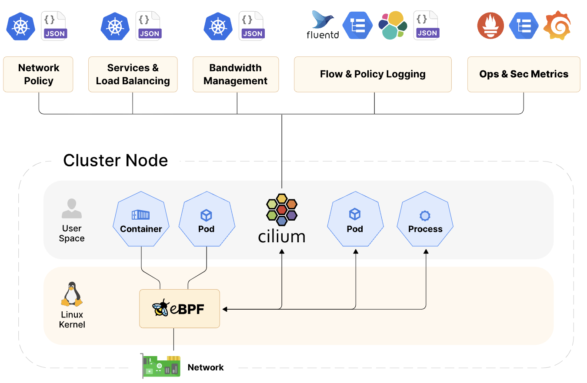
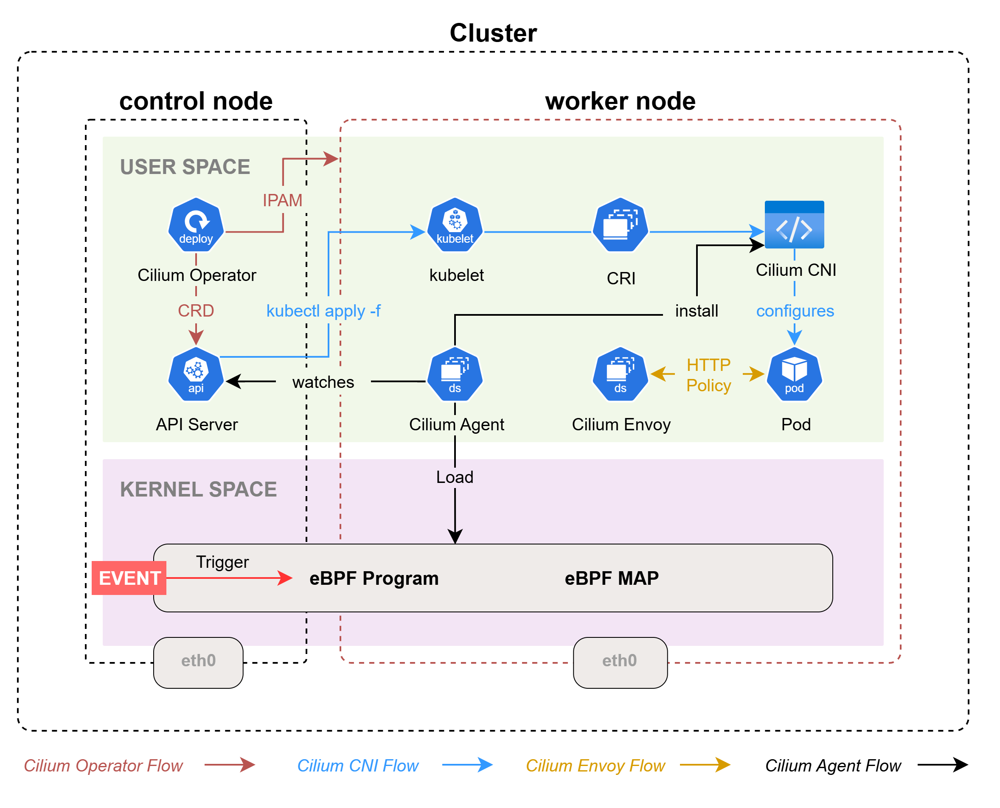
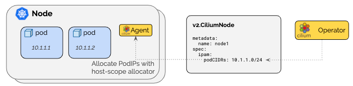

# Overview

- Cilium은 eBPF 기술을 이용해서 쿠버네티스의 네트워크와 보안 기능을 구현한 쿠버네티스의 CNI Plugin 이다.
- eBPF는 리눅스 커널의 소스코드 변경 없이 커널 내부에서 샌드박스 프로그램을 실행시켜 커널의 기능을 효율적으로 확장시킬 수 있다.


# Cilium Components

## 1. Cilium Components Diagram


### 1.1 Cilium Operator

- Deployment로 배포되어 쿠버네티스 클러스터 수준에서 처리해야 하는 작업(CRD, IPAM 등)을 관리한다.
- 각 노드에 생성되는 Cilium Node 객체에 PodCIDR 등의 정보를 주입하고 Cilium Agent가 이 정보를 기반으로 작업을 수행한다.

> [!NOTE]
> **Operator는 네트워킹 과정에 깊게 관여하지 않아 일시적인 중단에도 클러스터 동작에 큰 영향을 미치지 않는다.**

### 1.2 Cilium CNI Plug-in (Node Level 작업)

[rmfla]
- Pod 생성/삭제/주기적인 상태 확인 시 마다 Container Runtime Interface에 의해 실행되면서 네트워크 구성(가상 인터페이스 구성, IP 할당/해제 등) 작업을 수행한다.
- Operator, Agent, Envoy 처럼 컨테이너로 동작하지 않고 Container Runtime Interface에 의해 필요한 시점에만 호출되어 실행 후 종료된다.
- Binary 파일(/opt/cni/bin/cilium-cni, /etc/cni/net.d/05-cilium.conflist)로 각 노드에서 관리된다.

### 1.3 Cilium Agent (Kernel Level 작업, L3~4 계층)

[rmfla]
- 데몬셋(DeamonSet)으로 배포되어 각 노드에서 Pod로 실행된다.
- Cilium Agent는 eBPF Program & MAP을 커널에 로드하고 관리한다.
  - eBPF Program : 커널에서 발생시키는 이벤트(Hook Point)에 의해 실행되며, 네트워킹, 네트워크 정책 시행, 서비스 부하분산 등의 네트워크 기능을 수행한다.
  - eBPF MAP : eBPF Program이 사용하는 커널 내부에 구성되는 데이터 저장소다. User Space에서 MAP에 있는 데이터를 조회할 수도 있다.
- Cilium CNI Plug-in Binary 파일을 노드에 설치하여 전반적인 네트워크 구성의 기능을 제공한다.
- API Server와 통신하면서 쿠버네티스 리소스의 상태를 모니터링한다. 변경 사항이 발생하면 eBPF MAP을 업데이트 한다.

### 1.4 Envoy Proxy (UserSpace 작업, L7 계층)

- 데몬셋(DeamonSet)으로 배포되어 각 노드에서 Pod로 실행된다.
- Cilium L7 계층 관련 기능(Ingress, Gateway API, L7 Network Policies 등)이 Envoy Proxy를 통해 라우팅된다.
- HTTP 트래픽 제어, L7 Network Policy 시행, 정교한 라우팅 정책 관리와 같은 L7 기반 동적 라우팅/보안 기능을 제공한다.

> [!NOTE]
> **Cilium Agent & Envoy**
> - Cilium에서 L3~4 계층의 트래픽은 Kernel의 eBPF Program으로 관리하고, L7 계층의 트래픽 처리는 Envoy에 위임는 구조로 동작한다.
> - 이러한 구조로 인해 MetalLB의 지원 없이 직접 LB, Ingress의 External IP 할당을 관리할 수 있다.
> - Envoy는 Ingress 라우팅 규칙 관리, L7 계층 Network Policy 등을 구현하고, Ingress의 External IP에 대한 L2 announcement, BGP 처리는 eBPF에서 처리한다.
> - 기존의 Istio가 Sidecar 패턴으로 Envoy를 구성했던 것과 다르게 Cilium에서는 DaemonSet 형태로 구성한다.


## 2. Cilium CLI & Debugging Tool

- cilium-dbg : Cilium 구성과 관련된 일반 적인 상태 정보, 정책, 서비스 목록 등을 확인하는데 사용한다.
- bpftool : eBPF 수준의 디버깅이 필요한 경우 사용되는 도구로 커널에 로드된 eBPF 프로그램 목록, MAP 목록 조회 등에 사용한다.
- CLI는 Cilium Agent Pod 내부에서 실행할 수 있다.
- 편의를 위해 Control 노드에서 각 노드의 Cilium Agent를 통해 툴을 사용하도록 alias를 지정해서 사용할 수도 있다.

```bash
# /ect/profile
export CILIUMPOD0=$(kubectl get -l k8s-app=cilium pods -n kube-system --field-selector spec.nodeName=cilium-ctr -o jsonpath='{.items[0].metadata.name}')
export CILIUMPOD1=$(kubectl get -l k8s-app=cilium pods -n kube-system --field-selector spec.nodeName=cilium-w1 -o jsonpath='{.items[0].metadata.name}')
export CILIUMPOD2=$(kubectl get -l k8s-app=cilium pods -n kube-system --field-selector spec.nodeName=cilium-w2 -o jsonpath='{.items[0].metadata.name}')
export CILIUMPOD3=$(kubectl get -l k8s-app=cilium pods -n kube-system --field-selector spec.nodeName=cilium-w3 -o jsonpath='{.items[0].metadata.name}')
alias c0="kubectl exec -it $CILIUMPOD0 -n kube-system -c cilium-agent -- cilium"
alias c1="kubectl exec -it $CILIUMPOD1 -n kube-system -c cilium-agent -- cilium"
alias c2="kubectl exec -it $CILIUMPOD2 -n kube-system -c cilium-agent -- cilium"
alias c3="kubectl exec -it $CILIUMPOD3 -n kube-system -c cilium-agent -- cilium" 
alias c0bpf="kubectl exec -it $CILIUMPOD0 -n kube-system -c cilium-agent -- bpftool"
alias c1bpf="kubectl exec -it $CILIUMPOD1 -n kube-system -c cilium-agent -- bpftool"
alias c2bpf="kubectl exec -it $CILIUMPOD2 -n kube-system -c cilium-agent -- bpftool"
alias c3bpf="kubectl exec -it $CILIUMPOD3 -n kube-system -c cilium-agent -- bpftool"
```


# Network 구성

## 1. Network Interface 구조

[rmfla]
### 1.1 cilium_host

- 호스트 네트워크 네임스페이스에 구성되는 가상 이더넷(veth) 인터페이스다. (cilium_net과 veth pair로 연결)
- Pod와 클러스터 외부 트래픽, 호스트 트래픽를 연결하는 브릿지 역할을 수행한다.

> [!NOTE]
> **트래픽이 들어오면 eBPF 프로그램으로 전달하면서 파드 네트워크로 향하는 브릿지 역할을 수행한다.**

### 1.2 cilium_net

- 호스트 네트워크 네임스페이스에 구성되는 가상 이더넷(veth) 인터페이스다. (cilium_host와 veth pair로 연결)
- Cluster 내부에 배포된 Pod 간의 통신(보안 정책 적용, 패킷 필터링, 네트워크 성능 측정 등)을 처리한다.

### 1.3 cilium_health (lxc_health)

- cilium agent가 cluster network 상태 검사에 사용되는 health check 전용 인터페이스다.
- Pod의 veth pair로 구성되는 lxc 인터페이스와 구별되는 인터페이스다 (kubectl로 조회 불가능한 리소스)

### 1.4 lxcxxxxx

- Pod의 eth0 인터페이스와 veth pair로 연결되는 가상 이더넷 인터페이스다.
- 호스트 노드에서 IP 값은 표시되지 않지만 실제로는 Pod가 사용할 PodCIDR 대역의 IP가 할당되어 있다.

## 2. Cilium Network interface 세부 정보 조회
컨트롤 노드에서 인터페이스의 목록을 조회하면 cilium과 pod의 인터페이스 정보를 볼 수 있다. 호스트의 네트워크 네임스페이스와 격리된 파드의 네임스페이스 공간에 구성되는 pod 인터페이스(`lxc_xxx`)의 정보는 조회가 되지 않는데, 그 구조에 대한 세부적인 정보를 조회하는 방법은 [Pod Namespace 정보 조회](./_appendix_docs/1.%20%20pod%20namespace.md) 페이지를 참고한다.
```bash
root@cilium-ctr:~# ip -c -br addr show
lo               		UNKNOWN        127.0.0.1/8 ::1/128 
eth0             		UP             10.0.2.15/24 metric 100 fd17:625c:f037:2:a00:27ff:fe6b:69c9/64 fe80::a00:27ff:fe6b:69c9/64 
eth1             		UP             192.168.10.100/24 fe80::a00:27ff:fe07:c06/64 
cilium_net@cilium_host 	UP             fe80::dc73:f1ff:fe29:8b83/64 
cilium_host@cilium_net 	UP             172.20.0.156/32 fe80::648f:dfff:fe76:6a77/64 
lxc55e2d87ed58d@if8 	UP             fe80::5075:f4ff:fe01:6d42/64 
lxc64dcdd48bef3@if10 	UP             fe80::3c56:2bff:fe35:46f/64 
lxcaa4867de8527@if12 	UP             fe80::ecce:22ff:fe9e:80be/64 
lxc_health@if16  		UP             fe80::f405:5dff:fec8:1345/64 
```

### 2.1 Cilium의 `endpointRoutes.enabled` 옵션을 이용한 정보 조회
Cilium을 설치하면서 `endpointRoutes.enabled` 옵션을 추가할 경우 리눅스 커널이 관리하는 라우팅 테이블에 라우팅 정보가 반영된다.
- 컨트롤 노드에서 라우팅 정보를 조회하면 다음처럼 파드의 IP를 특정 lxc 인터페이스로 보내는 정보가 반영되어 있는 것을 확인할 수 있다.
```bash
root@cilium-ctr:~# ip -c route | grep lxc
172.20.0.106 dev lxc55e2d87ed58d proto kernel scope link 
172.20.0.174 dev lxc64dcdd48bef3 proto kernel scope link 
172.20.0.199 dev lxc_health proto kernel scope link 
172.20.0.223 dev lxcaa4867de8527 proto kernel scope link 
```

- kubectl을 이용해서 컨트롤 노드에 배포된 파드의 IP 정보를 확인하면 어떤 lxc 인터페이스가 각 파드와 pair 구조로 연동되어 있는지 유추해볼 수 있다.
```bash
root@cilium-ctr:~# kubectl get po -owide -A | grep ctr | grep 172.20
default              curl-pod-01                               1/1     Running   4 (4d16h ago)   14d    172.20.0.223     cilium-ctr   <none>           <none>
default              curl-pod-02                               1/1     Running   4 (4d16h ago)   14d    172.20.0.106     cilium-ctr   <none>           <none>
kube-system          coredns-7db7584c6c-hjvt5                  1/1     Running   1 (4d16h ago)   5d     172.20.0.174     cilium-ctr   <none>           <none>
```

### 2.2 Cilium 디버깅용 CLI를 통한 정보 조회
cilium agent가 제공하는 CLI를 이용해서 조금 더 상세하게 정보를 조회할 수도 있다. cilium agent를 이용해 파드의 상세 네트워크 정보를 조회하려면 파드의 ENDPOINT ID가 필요하다.
- 컨트롤 노드에 배포된 Agent를 이용해 관리하고 있는 파드의 IP 목록을 조회한다.
```bash
root@cilium-ctr:~# c0 status --verbose | grep -A6 "Allocated"
Allocated addresses:
  172.20.0.156 (router)		# 노드마다 Default로 생성되는 Address (호스트 노드의 cilium_host 인터페이스 IP가 할당된다.) 
  172.20.0.199 (health)		# 노드마다 Default로 생성되는 Address  
  172.20.0.223 (default/curl-pod-01 [restored]) 
  172.20.0.106 (default/curl-pod-02 [restored])
  172.20.0.174 (kube-system/coredns-7db7584c6c-hjvt5 [restored])
  172.20.0.214 (ingress)
```

- 확인한 파드의 IP를 이용해 파드의 ENDPOINT ID 정보를 조회한다.
```bash
root@cilium-ctr:~# c0 endpoint list | grep '172.20.0.223'
2097       Disabled           Disabled          37821      k8s:app=curl                                                                        172.20.0.223   ready   
```

- ENDPOINT ID를 이용해 인터페이스의 세부 정보를 조회한다.
```bash
root@cilium-ctr:~# CURL_ID_01=2097
root@cilium-ctr:~# c0 endpoint get $CURL_ID_01 | grep -A11 networking
      "networking": {
        "addressing": [
          {
            "ipv4": "172.20.0.223",
            "ipv4-pool-name": "default"
          }
        ],
        "container-interface-name": "eth0",
        "host-mac": "ee:ce:22:9e:80:be",
        "interface-index": 13,
        "interface-name": "lxcaa4867de8527",
        "mac": "6a:a8:ed:48:a2:59"
```

- 네트워크 정보 조회 결과를 확인하면 파드에 할당된 interface-name과 mac 주소 정보가 나온다. 호스트 네트워크 네임스페이스에서 조회된 정보와 비교하면 같은 값임을 볼 수 있다.
```bash
root@cilium-ctr:~# ip -c addr show lxcaa4867de8527
13: lxcaa4867de8527@if12: <BROADCAST,MULTICAST,UP,LOWER_UP> mtu 1500 qdisc noqueue state UP group default qlen 1000
    link/ether ee:ce:22:9e:80:be brd ff:ff:ff:ff:ff:ff link-netns cni-ff1729cb-1a90-4824-8302-22e034047e2c
    inet6 fe80::ecce:22ff:fe9e:80be/64 scope link 
       valid_lft forever preferred_lft forever
```
```bash
root@cilium-ctr:~# kubectl exec -it curl-pod-01 -- ip -c addr show eth0
12: eth0@if13: <BROADCAST,MULTICAST,UP,LOWER_UP> mtu 1500 qdisc noqueue state UP group default 
    link/ether 6a:a8:ed:48:a2:59 brd ff:ff:ff:ff:ff:ff link-netnsid 0
    inet 172.20.0.223/32 scope global eth0
       valid_lft forever preferred_lft forever
    inet6 fe80::68a8:edff:fe48:a259/64 scope link proto kernel_ll 
       valid_lft forever preferred_lft forever
```

## 3. eBPF Datapath (Packet Flow)

- L7 Network Policy, Encryption, Network Mode 설정이 적용된 경우 점선으로 표시된 항목들까지 통신 경로에 추가 된다.
- 활성화한 기능이 없을 경우 Pod의 인터페이스에서 패킷이 출발하는 순간 커널의 TCX(Traffic Control eXpress) Hook을 통해 eBPF 프로그램이 트리거 된다. - [LINK](https://841lgfvhej.execute-api.ap-northeast-2.amazonaws.com/default/image?url=https://gist.githubusercontent.com/Zerotay/b31bec275d1f8f6291075ca6a56264f3/raw/image.png)
- 이 때 네트워크 트래픽은 커널 내부의 eBPF 프로그램에 의해서 정책이 평가되고, 평가 결과에 따라서 Flow가 결정된다.

### 3.1 같은 노드에 배치된 Pod 간의 Datapath


### 3.2 Pod에서 외부로 나가는 트래픽의 Datapath


### 3.3  Pod 내부로 들어오는 트래픽의 Datapath


## 4. Datapath 과정에 사용되는 eBPF Program의 상세 정보 조회 방법

### 4.1 eBPF Program 정보 조회

- eBPF Program은 Cilium Agent에 의해서 커널에 배포된다.
- 각 Agent에 접속한 다음 /var/lib/cilium/bpf 폴더를 확인해 보면 배포되는 파일들의 목록을 볼 수 있다.
- 해당 코드들은 Cilium GirHub 문서에서도 확인할 수 있다. [LINK](https://github.com/cilium/cilium/tree/main/bpf)

```bash
root@cilium-ctr:~# echo $CILIUMPOD0
cilium-fttl8
root@cilium-ctr:~# kubectl exec -it $CILIUMPOD0 -n kube-system -- bash
root@cilium-ctr:/home/cilium# cd /var/lib/cilium/bpf
root@cilium-ctr:/home/cilium# ls -al
total 336
drwxr-xr-x 1 root root  4096 Jul 16 10:05 .
drwxr-x--- 1 root root  4096 Jul 28 14:05 ..
-rw-r--r-- 1 root root   420 Jul 16 10:05 COPYING
-rw-r--r-- 1 root root  1296 Jul 16 10:05 LICENSE.BSD-2-Clause
-rw-r--r-- 1 root root 18012 Jul 16 10:05 LICENSE.GPL-2.0
-rw-r--r-- 1 root root 20261 Jul 16 10:05 Makefile
-rw-r--r-- 1 root root  3533 Jul 16 10:05 Makefile.bpf
-rw-r--r-- 1 root root  2945 Jul 16 10:05 bpf_alignchecker.c
-rw-r--r-- 1 root root 58666 Jul 16 10:05 bpf_host.c
-rw-r--r-- 1 root root 76153 Jul 16 10:05 bpf_lxc.c       # lxcxxx interface를 지날 때 트리거 되는 eBPF 프로그램
-rw-r--r-- 1 root root  2797 Jul 16 10:05 bpf_network.c
-rw-r--r-- 1 root root 25289 Jul 16 10:05 bpf_overlay.c
-rw-r--r-- 1 root root 31334 Jul 16 10:05 bpf_sock.c
-rw-r--r-- 1 root root  1424 Jul 16 10:05 bpf_wireguard.c
-rw-r--r-- 1 root root  9064 Jul 16 10:05 bpf_xdp.c
drwxr-xr-x 6 root root  4096 Jul 16 10:05 complexity-tests
drwxr-xr-x 2 root root  4096 Jul 16 10:05 custom
-rw-r--r-- 1 root root  1870 Jul 16 10:05 ep_config.h
-rw-r--r-- 1 root root   517 Jul 16 10:05 filter_config.h
drwxr-xr-x 1 root root  4096 Jul 16 10:05 include
drwxr-xr-x 2 root root  4096 Jul 16 10:05 lib
-rw-r--r-- 1 root root   404 Jul 16 10:05 netdev_config.h
-rw-r--r-- 1 root root 10753 Jul 16 10:05 node_config.h
drwxr-xr-x 4 root root  4096 Jul 16 10:05 tests
```

### 4.2 Pod 인터페이스에 할당되는 eBPF Program 세부 정보 조회
- Pod에 할당되는 eBPF Program은 인터페이스에 할당되는데 Cilium Agent가 제공하는 CLI로 해당 정보를 조회할 수 있다.
```bash
root@cilium-ctr:~# c0 endpoint get $CURL_ID_01 | grep interface-name | grep lxc
        "interface-name": "lxcaa4867de8527",
---
root@cilium-ctr:~# c0bpf net show | grep lxcaa4867de8527
lxcaa4867de8527(13) tcx/ingress cil_from_container prog_id 11945 link_id 25 
lxcaa4867de8527(13) tcx/egress cil_to_container prog_id 11955 link_id 26 
```
  - tcx/ingress, tcx/egress 네트워크 스택을 트래픽이 지나갈 때 Hook 이 동작하여 eBPF Program에 전달한다.
  - cil_to_container : 파드로 들어오는 트래픽에 해당 eBPF Program이 적용된다.
  - cil_from_container : 파드에서 나가는 트래픽이 해당 eBPF Program이 적용된다.
- 파드의 인터페이스 외에도 socket 스택이나 설정에 따라 XC 등 프로그램이 적용될 수 있는데 그 정보는 `/sys/fs/bpf` 폴더에서 확인할 수 있다.
```bash
root@cilium-ctr:~/workspace/l2announce# tree /sys/fs/bpf/cilium/
/sys/fs/bpf/cilium/
├── devices
│   ├── cilium_host
│   │   └── links
│   │       ├── cil_from_host
│   │       └── cil_to_host
│   ├── cilium_net
│   │   └── links
│   │       └── cil_to_host
│   ├── eth0
│   │   └── links
│   │       ├── cil_from_netdev
│   │       └── cil_to_netdev
│   └── eth1
│       └── links
│           ├── cil_from_netdev
│           └── cil_to_netdev
├── endpoints
│   ├── 107
│   │   └── links
│   │       ├── cil_from_container
│   │       └── cil_to_container
│   ├── 1381
│   │   └── links
│   │       ├── cil_from_container
│   │       └── cil_to_container
│   ├── 820
│   │   └── links
│   │       ├── cil_from_container
│   │       └── cil_to_container
│   ├── 935
│   │   └── links
│   │       ├── cil_from_container
│   │       └── cil_to_container
│   ├── 940
│   │   └── links
│   │       ├── cil_from_container
│   │       └── cil_to_container
│   └── 951
│       └── links
│           ├── cil_from_container
│           └── cil_to_container
└── socketlb
    └── links
        └── cgroup
            ├── cil_sock4_connect
            ├── cil_sock4_getpeername
            ├── cil_sock4_post_bind
            ├── cil_sock4_recvmsg
            ├── cil_sock4_sendmsg
            ├── cil_sock6_connect
            ├── cil_sock6_getpeername
            ├── cil_sock6_post_bind
            ├── cil_sock6_recvmsg
            ├── cil_sock6_sendmsg
            └── cil_sock_release
```
- eBPF 프로그램이 커널에 로드되는 정보는 [Cilium Agent가 eBPF 프로그램 로드하는 과정](./_appendix_docs/2.%20cilium%20agent%20eBPF%20program%20loading%20process.md) 페이지를 참고한다.