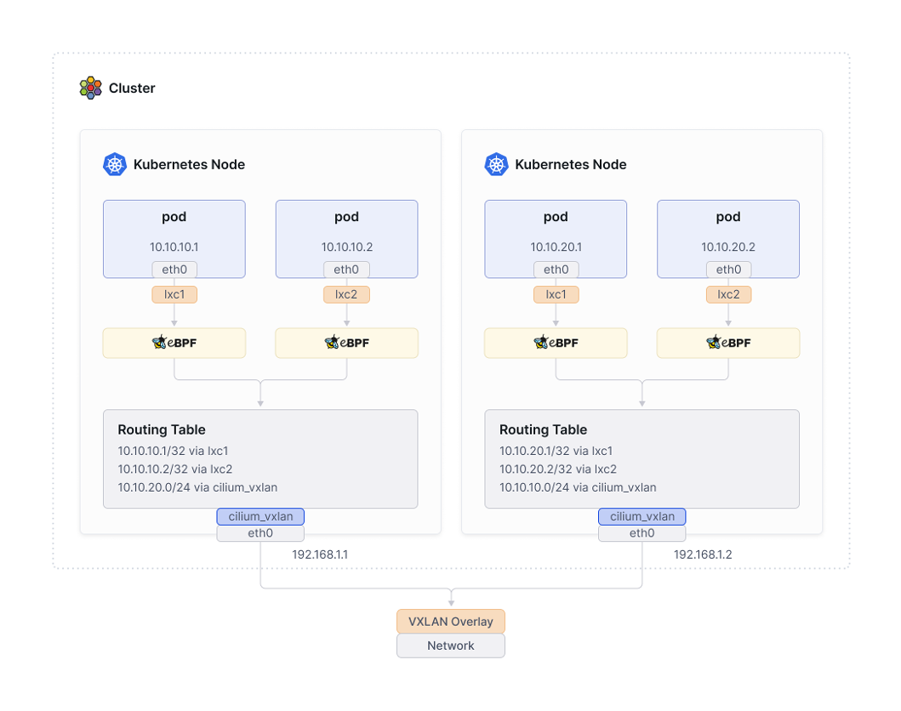
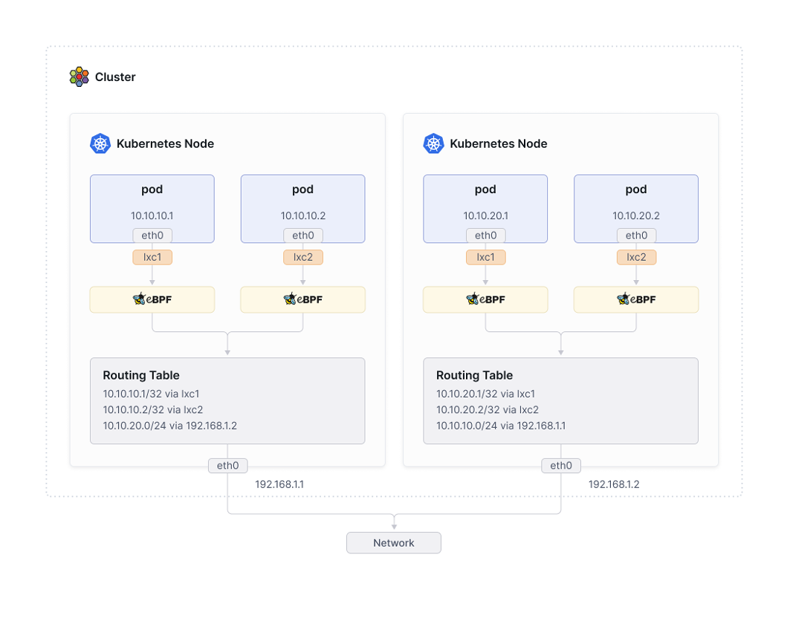

# Overview

- 기존의 전통적인(Standard) 방식의 CNI 기능은 kube-proxy(iptables)를 기반으로 동작한다.
- Cilium에서는 "kube-proxy 대체 모드"를 사용하면 kube-proxy 없이도 클러스터 네트워킹을 구현할 수 있다.
- eBPF 기반의 Cilium CNI는 kube-proxy(iptables)를 사용하는 환경보다 더 좋은 성능을 보여준다. → [eBPF와 iptables의 성능 비교](./_appendix_docs/3.%20ebpf%20vs%20iptables.md)

# Cilium Network Mode
쿠버네티스 클러스터 내부 통신의 방식을 결정하는 Netwotk Mode는 크게 두 가지가 제공된다. VxLAN과 Geneve 기술을 이용하는 Ensapsulation 모드와 리눅스 커널의 라우팅 기능을 이용하는 Native/Direct 모드다.

## 1. Encapsulation Routing Mode (Default)

- UDP 기반 캡슐화 프로토콜인 VXLAN 또는 Geneve를 사용하여 모든 노드 간에 터널 메시가 생성된다. → [VxLAN, Geneve 기본 개념](./_appendix_docs/4.%20vxlan,%20geneve.md)
- 노드 간 통신 트래픽은 모두 VXLAN 또는 Geneve을 통해서 캡슐화된다.
- Pod 네트워크는 노드 네트워크의 영향을 받지 않기 때문에 환경에 종속되지 않고 간단하게 구성할 수 있는 장점이 있다.
- 캡슐화를 통해 헤더가 추가되면서 패킷의 효율이 미미하게 떨어지는데, 최적의 네트워크 성능 보장이 필요한 경우 Native/Direct 모드가 적합하다.

## 2. Native Routing Mode

- 캡슐화 기능 대신 Cilium의 네트워크 기능과 리눅스 커널의 라우팅 시스템을 이용해서 통신한다.
- 각 노드에는 Cilium Agent가 구성되고, Agent는 해당 노드의 Pod들에 대한 네트워크만 관리한다.
- 따라서 다른 노드로 향하는 트래픽은 리눅스 커널의 라우팅 시스템에 위임하여 처리된다.
  - 각 노드는 서로 다른 노드에 할당된 PodCIDR 정보를 인식하고, 커널 라우팅 테이블에 해당 노드로 향하는 경로가 추가된다.
  - L2 네트워크 프로토콜을 사용하는 경우 auto-direct-node-routes 옵션을 활성화하여 구성할 수 있다.
  - 또는, BGP 데몬을 활성화한 다음 서로의 라우팅 경로를 배포하도록 구성해야 한다.

