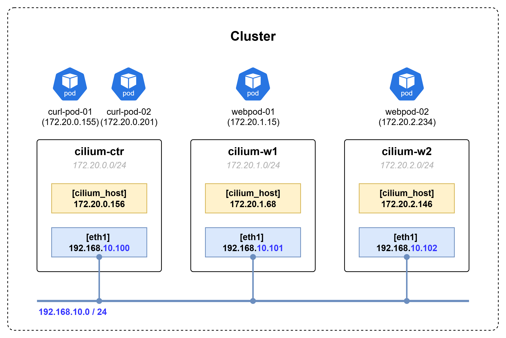
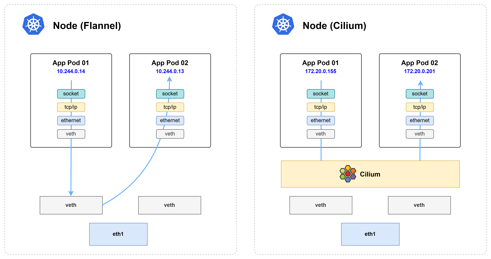
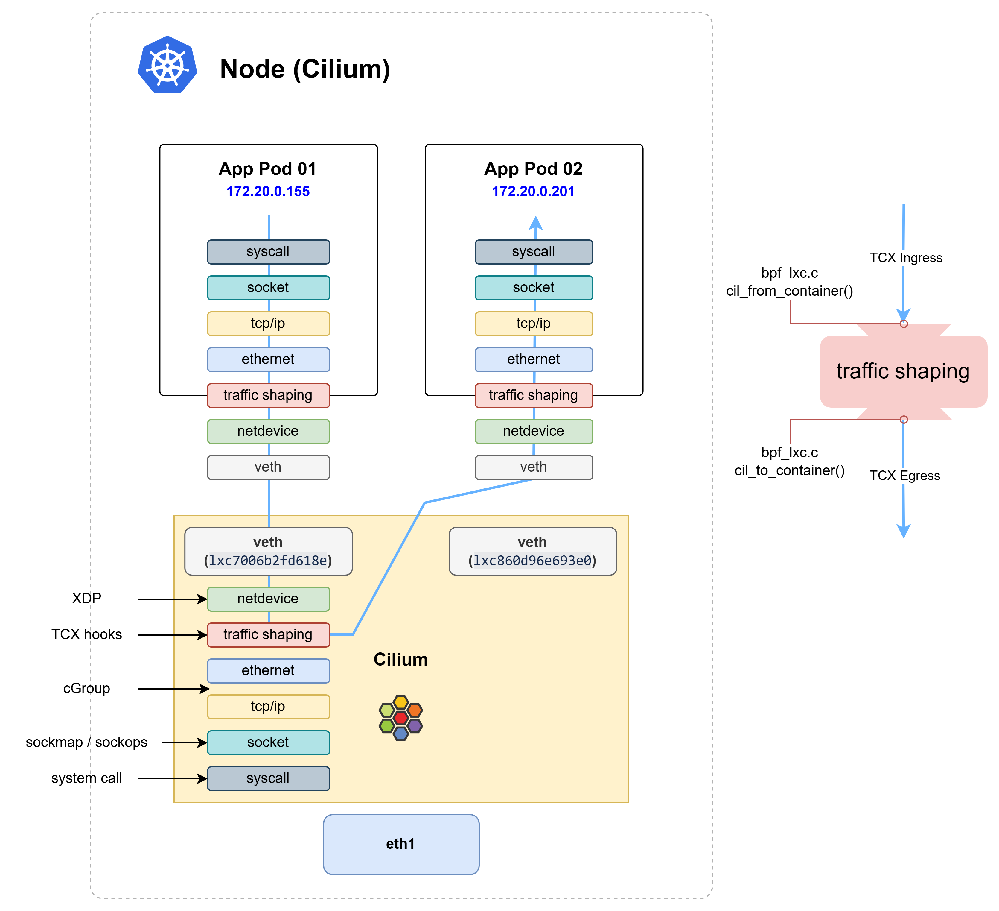
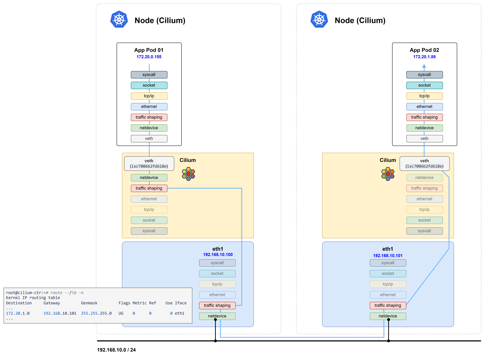
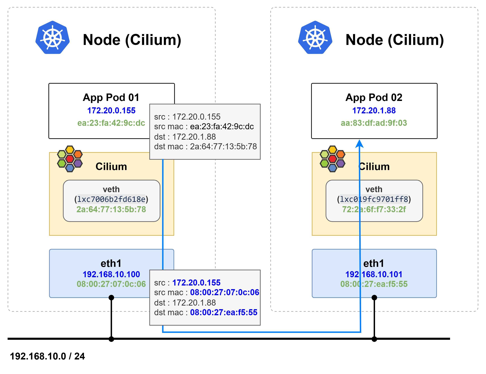
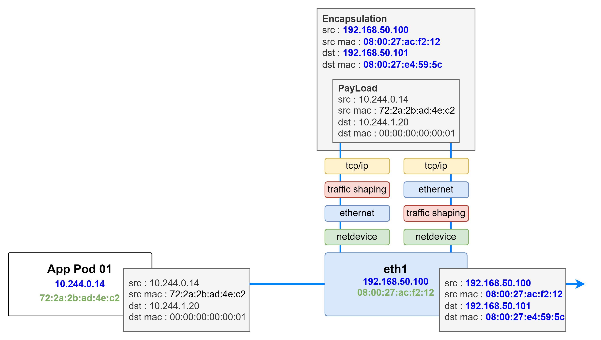

# Overview

- 기존의 전통적인(Standard) 방식의 CNI 기능은 kube-proxy(iptables)를 기반으로 동작한다.
- Cilium에서는 "kube-proxy 대체 모드"를 사용하면 kube-proxy 없이도 클러스터 네트워킹을 구현할 수 있다.
- eBPF 기반의 Cilium CNI는 kube-proxy(iptables)를 사용하는 환경보다 더 좋은 성능을 보여준다. → [eBPF와 iptables의 성능 비교](./_appendix_docs/3.%20ebpf%20vs%20iptables.md)


# Cilium Network Mode
쿠버네티스 클러스터 내부 통신의 방식을 결정하는 Netwotk Mode는 크게 두 가지가 제공된다. VxLAN과 Geneve 기술을 이용하는 Ensapsulation 모드와 리눅스 커널의 라우팅 기능을 이용하는 Native/Direct 모드다.

## 1. Encapsulation Routing Mode (Default)


- UDP 기반 캡슐화 프로토콜인 VXLAN 또는 Geneve를 사용하여 모든 노드 간에 터널 메시가 생성된다. → [VxLAN, Geneve 기본 개념](./_appendix_docs/4.%20vxlan,%20geneve.md)
- 노드 간 통신 트래픽은 모두 VXLAN 또는 Geneve을 통해서 캡슐화된다.
- Pod 네트워크는 노드 네트워크의 영향을 받지 않기 때문에 환경에 종속되지 않고 간단하게 구성할 수 있는 장점이 있다.
- 캡슐화를 통해 헤더가 추가되면서 패킷의 효율이 미미하게 떨어지는데, 최적의 네트워크 성능 보장이 필요한 경우 Native/Direct 모드가 적합하다.

## 2. Native Routing Mode


- 캡슐화 기능 대신 Cilium의 네트워크 기능과 리눅스 커널의 라우팅 시스템을 이용해서 통신한다.
- 각 노드에는 Cilium Agent가 구성되고, Agent는 해당 노드의 Pod들에 대한 네트워크만 관리한다.
- 따라서 다른 노드로 향하는 트래픽은 리눅스 커널의 라우팅 시스템에 위임하여 처리된다.
  - 각 노드는 서로 다른 노드에 할당된 PodCIDR 정보를 인식하고, 커널 라우팅 테이블에 해당 노드로 향하는 경로가 추가된다.
  - L2 네트워크 프로토콜을 사용하는 경우 auto-direct-node-routes 옵션을 활성화하여 구성할 수 있다.
  - 또는, BGP 데몬을 활성화한 다음 서로의 라우팅 경로를 배포하도록 구성해야 한다.

# Network Routing Mode 네트워크 통신 테스트
네트워크 통신 테스트 과정에 kube-proxy를 사용하는 Flannel CNI와 비교를 통해 네트워크 통신 과정이 어떻게 차이가 발생하는지 확인한다.

## 1. Kubernetes Cluster Diagram


## 2. Native Routing 모드 설치 옵션

### 2.1 Native Routing Mode 관련 설치 옵션

```bash
helm install cilium cilium/cilium --version 1.18.0 --namespace kube-system \
--set k8sServiceHost=192.168.10.100 --set k8sServicePort=6443 \
--set kubeProxyReplacement=true \
--set routingMode=native \
--set autoDirectNodeRoutes=true \
--set ipam.mode="cluster-pool" \
--set ipam.operator.clusterPoolIPv4PodCIDRList={"172.20.0.0/16"} \
--set ipv4NativeRoutingCIDR=172.20.0.0/16 \
--set endpointRoutes.enabled=true \
--set installNoConntrackIptablesRules=true \
--set bpf.masquerade=true \
--set ipv6.enabled=false
```
- k8sServiceHost, k8sServicePort : 쿠버네티스 API 서버 정보 입력
- kubeProxyReplacement : cilium으로 kube proxy 기능을 대체하는 옵션
- routingMode : Native / Encapsulation Mode 지정
- autoDirectNodeRoutes : 다른 노드에 반영되어 있는 PodCIDR 정보를 자동으로 호스트 노드의 Route 정보에 입력
- endpointRoutes.enabled : Pod에게 할당되는 호스트의 lxc 인터페이스에 대한 커널 라우팅 설정을 자동으로 추가하는 옵션

### 2.2 Cilium과 Flannel CNI 배포 후 kube-proxy 파드 체크

```bash
# NOTE:: Cilium
root@cilium-ctr:~# kubectl get po -n kube-system -owide | grep kube
kube-apiserver-cilium-ctr            1/1     Running   4 (4d17h ago)   15d    192.168.10.100   cilium-ctr   <none>           <none>
kube-controller-manager-cilium-ctr   1/1     Running   5 (4d17h ago)   15d    192.168.10.100   cilium-ctr   <none>           <none>
kube-scheduler-cilium-ctr            1/1     Running   5 (4d17h ago)   15d    192.168.10.100   cilium-ctr   <none>           <none>
# NOTE:: Flannel
root@flannel-ctr:~# kubectl get po -n kube-system -owide | grep kube
kube-apiserver-flannel-ctr            1/1     Running   3 (2m19s ago)   10d   192.168.50.100   flannel-ctr   <none>           <none>
kube-controller-manager-flannel-ctr   1/1     Running   3 (2m19s ago)   10d   192.168.50.100   flannel-ctr   <none>           <none>
kube-proxy-99kl8                      1/1     Running   1 (8d ago)      10d   192.168.50.101   flannel-w1    <none>           <none>
kube-proxy-wzhn9                      1/1     Running   2 (98s ago)     10d   192.168.50.102   flannel-w2    <none>           <none>
kube-proxy-xtk6q                      1/1     Running   3 (2m19s ago)   10d   192.168.50.100   flannel-ctr   <none>           <none>
kube-scheduler-flannel-ctr            1/1     Running   3 (2m19s ago)   10d   192.168.50.100   flannel-ctr   <none>           <none>
```

### 2.3 autoDirectNodeRoute 옵션을 통해 커널 라우팅 테이블 경로 정보 확인

- 노드 별 할당된 PodCIDR 정보 확인

  ```bash
  $ kubectl get ciliumnode -o jsonpath='{range .items[*]}{.metadata.name}{" "}{.spec.ipam.podCIDRs[*]}{"\n"}{end}' | column -t
  cilium-ctr  172.20.0.0/24
  cilium-w1   172.20.1.0/24
  cilium-w2   172.20.2.0/24
  ```

-  노드 별 라우팅 테이블 정보 조회
  
  ```bash
  $  for i in ctr w1 w2 ; do echo ">> node : cilium-$i <<"; sshpass -p 'vagrant' ssh -o StrictHostKeyChecking=no vagrant@cilium-$i ip -c route | grep 172.20 | grep eth1 ; echo; done
  >> node : cilium-ctr <<
  172.20.1.0/24 via 192.168.10.101 dev eth1 proto kernel 
  172.20.2.0/24 via 192.168.10.102 dev eth1 proto kernel 

  >> node : cilium-w1 <<
  172.20.0.0/24 via 192.168.10.100 dev eth1 proto kernel 
  172.20.2.0/24 via 192.168.10.102 dev eth1 proto kernel 

  >> node : cilium-w2 <<
  172.20.0.0/24 via 192.168.10.100 dev eth1 proto kernel 
  172.20.1.0/24 via 192.168.10.101 dev eth1 proto kernel
  ```

### 2.4 endpointRoute 옵션을 통해 커널 라우팅 테이블에 반영된 Pod 라우팅 정보 확인

- 컨트롤 노드 Pod 정보 / 라우팅 테이블 확인

  ```bash
  root@cilium-ctr:~# kubectl get po -owide
  NAME                      READY   STATUS    RESTARTS        AGE    IP             NODE         NOMINATED NODE   READINESS GATES
  curl-pod-01               1/1     Running   4 (4d17h ago)   14d    172.20.0.223   cilium-ctr   <none>           <none>
  curl-pod-02               1/1     Running   4 (4d17h ago)   14d    172.20.0.106   cilium-ctr   <none>           <none>
  webpod-697b545f57-d98p8   1/1     Running   0               4d8h   172.20.1.79    cilium-w1    <none>           <none>
  webpod-697b545f57-g2gpc   1/1     Running   0               4d8h   172.20.1.37    cilium-w1    <none>           <none>
  webpod-697b545f57-zc48g   1/1     Running   0               4d8h   172.20.1.172   cilium-w1    <none>           <none>
  root@cilium-ctr:~# ip -c route | grep lxc
  172.20.0.106 dev lxc55e2d87ed58d proto kernel scope link 
  172.20.0.174 dev lxc64dcdd48bef3 proto kernel scope link 
  172.20.0.199 dev lxc_health proto kernel scope link 
  172.20.0.223 dev lxcaa4867de8527 proto kernel scope link 
  ```

- 노드 별 커널 라우팅 테이블에 반영된 Pod 라우팅 정보 확인

  ```bash
  $ for i in ctr w1 w2 ; do echo ">> node : cilium-$i <<"; sshpass -p 'vagrant' ssh -o StrictHostKeyChecking=no vagrant@cilium-$i ip -c route | grep lxc ; echo; done
  >> node : cilium-ctr <<
  172.20.0.106 dev lxc55e2d87ed58d proto kernel scope link 
  172.20.0.174 dev lxc64dcdd48bef3 proto kernel scope link 
  172.20.0.199 dev lxc_health proto kernel scope link 
  172.20.0.223 dev lxcaa4867de8527 proto kernel scope link 

  >> node : cilium-w1 <<
  172.20.1.22 dev lxcd6e02159067c proto kernel scope link 
  172.20.1.28 dev lxc8afbe821270f proto kernel scope link 
  172.20.1.37 dev lxce3fdc320e7ec proto kernel scope link 
  172.20.1.53 dev lxc84ce89a08c9c proto kernel scope link 
  172.20.1.79 dev lxc96d69fa3eac1 proto kernel scope link 
  172.20.1.81 dev lxc2191a5f18030 proto kernel scope link 
  172.20.1.88 dev lxcd5321c3039e9 proto kernel scope link 
  172.20.1.107 dev lxcb86432fc2a99 proto kernel scope link 
  172.20.1.172 dev lxc43a39a07132a proto kernel scope link 
  172.20.1.191 dev lxc0736ca4dfa75 proto kernel scope link 
  172.20.1.248 dev lxc_health proto kernel scope link 

  >> node : cilium-w2 <<
  172.20.2.23 dev lxc_health proto kernel scope link 
  ```


## 3. 통신 테스트

### 3.1 같은 노드에 배포된 두 개의 Pod 간의 통신

#### 3.1.1 Cilium은 통신 과정 중 eBPF 프로그램이 패킷을 가로채서 처리한다.



- Cilium의 통신 과정은 kube-proxy를 사용하는 다른 CNI(Flannel, Calico 등)와 다르다.
- 다이어그램을 보면 Cilium은 패킷이 호스트 네임스페이스의 veth 인터페이스로 향하는 중간 과정에 eBPF 프로그램이 패킷을 처리해 버린다.
- 반면, kube-proxy를 사용하는 CNI 환경에서는 호스트 네임스페이스의 veth 인터페이스를 거쳐서 목적지까지 패킷이 전달된다.
- 통신 과정을 tcpdump를 통해서 확인하면 실제로 Cilium은 IN 패킷만 보이고, Flannel에서는 IN/OUT 패킷이 모두 보인다.

  ```bash
  # NOTE:: Cilium
  root@cilium-ctr:~# kubectl exec -it curl-pod-01 -- ping -c 1 172.20.0.201
  PING 172.20.0.201 (172.20.0.201) 56(84) bytes of data.
  64 bytes from 172.20.0.201: icmp_seq=1 ttl=63 time=0.073 ms
  ---
  root@cilium-ctr:~# tcpdump -enni any icmp -q
  tcpdump: data link type LINUX_SLL2
  tcpdump: verbose output suppressed, use -v[v]... for full protocol decode
  listening on any, link-type LINUX_SLL2 (Linux cooked v2), snapshot length 262144 bytes
  18:00:28.340419 lxc7006b2fd618e In  ifindex 19 ea:23:fa:42:9c:dc 172.20.0.155 > 172.20.0.201: ICMP echo request, id 6, seq 1, length 64
  18:00:28.340467 lxc860d96e693e0 In  ifindex 21 da:e3:68:22:c7:d2 172.20.0.201 > 172.20.0.155: ICMP echo reply, id 6, seq 1, length 64
  # NOTE:: Flannel
  (⎈|HomeLab:N/A) root@flannel-ctr:~# kubectl get po -owide | grep curl
  curl-pod-01               1/1     Running       2 (55m ago)   10d    10.244.0.14   flannel-ctr   <none>           <none>
  curl-pod-02               1/1     Running       2 (55m ago)   10d    10.244.0.13   flannel-ctr   <none>           <none>
  ---
  (⎈|HomeLab:N/A) root@flannel-ctr:~#  kubectl exec -it curl-pod-01 -- ping -c 1 10.244.0.13 
  PING 10.244.0.13 (10.244.0.13) 56(84) bytes of data.
  64 bytes from 10.244.0.13: icmp_seq=1 ttl=64 time=0.060 ms
  ---
  (⎈|HomeLab:N/A) root@flannel-ctr:~# tcpdump -enni any icmp -q
  tcpdump: data link type LINUX_SLL2
  tcpdump: verbose output suppressed, use -v[v]... for full protocol decode
  listening on any, link-type LINUX_SLL2 (Linux cooked v2), snapshot length 262144 bytes
  17:51:19.155059 vethb8a69da2 P   ifindex 8 72:2a:2b:ad:4e:c2 10.244.0.14 > 10.244.0.13: ICMP echo request, id 13, seq 1, length 64
  17:51:19.155087 vethc7e5b8c2 Out ifindex 7 72:2a:2b:ad:4e:c2 10.244.0.14 > 10.244.0.13: ICMP echo request, id 13, seq 1, length 64
  17:51:19.155096 vethc7e5b8c2 P   ifindex 7 8e:64:ce:1b:77:bf 10.244.0.13 > 10.244.0.14: ICMP echo reply, id 13, seq 1, length 64
  17:51:19.155099 vethb8a69da2 Out ifindex 8 8e:64:ce:1b:77:bf 10.244.0.13 > 10.244.0.14: ICMP echo reply, id 13, seq 1, length 64
  ```

#### 3.1.2 Cilium은 Proxy ARP를 통해 통신한다.

- Cilium은 호스트 네임스페이스의 veth pair로 구성된 인터페이스의 MAC 주소를 Proxy ARP 방식으로 통신한다.
- 그래서 내·외부 통신 모두 하나의 MAC 주소를 사용하는데, MAC 주소 테이블 정보를 조회하면 확인할 수 있다.

  ```bash
  # NOTE:: Cilium
  root@cilium-ctr:~# kubectl exec -it curl-pod-01 -- ping -c 1 172.20.0.201
  PING 172.20.0.201 (172.20.0.201) 56(84) bytes of data.
  64 bytes from 172.20.0.201: icmp_seq=1 ttl=63 time=0.050 ms
  ---
  root@cilium-ctr:~# kubectl exec -it curl-pod-01 -- arp -a
  ? (172.20.0.156) at 2a:64:77:13:5b:78 [ether]  on eth0
  ? (10.0.2.15) at 2a:64:77:13:5b:78 [ether]  on eth0
  ```

- 반면, kube-proxy를 사용하는 환경은 브릿지 네트워크 인터페이스의 MAC 주소 테이블 정보를 기반으로 L2 스위칭 통신한다.
- 그래서 같은 노드에 속한 파드간의 통신에는 상대 파드의 MAC 주소가 테이블에 반영되지만 외부 통신 시 호스트의 MAC 주소가 기록된다.

  ```bash
  # NOTE:: Flannel
  (⎈|HomeLab:N/A) root@flannel-ctr:~#  kubectl exec -it curl-pod-01 -- ping -c 1 10.244.0.13 
  PING 10.244.0.13 (10.244.0.13) 56(84) bytes of data.
  64 bytes from 10.244.0.13: icmp_seq=1 ttl=64 time=0.060 ms
  ---
  (⎈|HomeLab:N/A) root@flannel-ctr:~# kubectl exec -it curl-pod-01 -- arp -a
  ? (10.244.0.15) at 12:c7:e7:d9:ee:bb [ether]  on eth0		# coredns
  ? (10.244.0.13) at 8e:64:ce:1b:77:bf [ether]  on eth0		# curl-pod-02
  ? (10.244.0.1) at 6e:a1:0c:34:90:f1 [ether]  on eth0		# Host
  ? (10.244.0.12) at 8e:7e:04:c8:01:cf [ether]  on eth0		# coredns 
  ```

#### 3.1.3 eBPF 프로그램 코드 분석

- 통신 과정에 사용되는 [Cilium의 eBPF 프로그램](https://docs.cilium.io/en/stable/_images/cilium_bpf_endpoint.svg)은 `bpf_lxc.c` 파일이다.
- eBPF 프로그램은 네트워크 스택의 커널 Hook 포인트에 할당된다. 파드 간의 통신에는 Traffic Shaping 스택의 TCX Hooks 포인트다.

  > [!NOTE]
  > **인터페이스에 할당된 eBPF 프로그램 조회**
  > - Cilium Overview 페이지에서 다루었던 3.4 Datapath 과정에 사용되는 eBPF 프로그램 상세 정보 조회 방법으로 조회하면 확인할 수 있다.
  > - 호스트 네임스페이스에 구성된 veth pair 인터페이스의 TCX Ingress, Egress Hook 포인트에 bpf_lxc.c 파일의 cil_from_container(), cil_to_container() 함수가 사용되고 있음을 확인할 수 있다.
  > ```bash
  > root@cilium-ctr:~# c0bpf net show | grep lxc7006b2fd618e
  > lxc7006b2fd618e(19) tcx/ingress cil_from_container prog_id 12258 link_id 37 
  > lxc7006b2fd618e(19) tcx/egress cil_to_container prog_id 12280 link_id 38 
  > ```


##### 3.1.3.1 cil_from_container()

- cil_from_container() 함수는 트래픽이 들어오면 handle_ipv4_from_lxc() 함수를 tail_call 방식으로 호출한다.

  ```c
  # /var/lib/cilium/bpf/bpf_lxc.c
  int cil_from_container(struct __ctx_buff *ctx)
  {
    ...
    switch (proto) {
    ...
  #ifdef ENABLE_IPV4
    case bpf_htons(ETH_P_IP):
      edt_set_aggregate(ctx, LXC_ID);
    /* ipv4_from_lxc 함수를 tail_call 방식으로 호출 */
      ret = tail_call_internal(ctx, CILIUM_CALL_IPV4_FROM_LXC, &ext_err);
      sec_label = SECLABEL_IPV4;
      break;
    ...
  }
  ```

- handle_ipv4_from_lxc() 함수에서는 lookup 함수를 통해 목적지가 클러스터 내부인지 외부인지 확인 후 트래픽을 처리한다.

  ```c
  # /var/lib/cilium/bpf/bpf_lxc.c
  static __always_inline int handle_ipv4_from_lxc(struct __ctx_buff *ctx, __u32 *dst_sec_identity, __s8 *ext_err)
  {
    ...
    /* Cilium이 관리하는 클러스터 내부 엔드포인트 여부 확인 후 Netowork Policy 정책에 활용 */
    info = lookup_ip4_remote_endpoint(ip4->daddr, cluster_id);
    ...
    /* 동일 호스트 노드에 존재하는 엔드포인트 여부 확인 후 라우팅에 활용  */
      ep = __lookup_ip4_endpoint(daddr);
    if(ep) {
      ...
      /* 같은 호스트 노드에 배포된 경우 ipv4_local_delivery() 함수로 처리 */
        return ipv4_local_delivery(ctx, ETH_HLEN, SECLABEL_IPV4, MARK_MAGIC_IDENTITY, ip4, ep, METRIC_EGRESS, from_l7lb, false, 0);
    }
    ...
  }
  ```

- 클러스터 내부 통신을 확인하기 위한 `lookup_ip4_remote_endpoint()` 함수는 Macro 함수를 통해 `ipcache_lookup4()` 함수로 치환된다.

```c
# /var/lib/cilium/bpf/lib/eps.h
/* 
 * Macro 함수로 lookup_ip4_remote_endpoint() Macro 를 호출하면 ipcache_lookup4() 함수로 치환된다. 
 * ipcache_lookup4() 함수에 전달하는 파라미터를 보면 cilium_ipcache_v2 eBPF MAP 정보를 전달한다.
 */
#define lookup_ip4_remote_endpoint(addr, cluster_id) \
ipcache_lookup4(&cilium_ipcache_v2, addr, V4_CACHE_KEY_LEN, cluster_id)
```

- `ipcache_lookup4()` 함수는 eBPF MAP을 검색하는데 인자 값으로 전달 받은 &cilium_ipcache_v2 Map을 검색해서 IP가 있으면 클러스터 내부 리소스로 인식한다.

  ```c
  # /var/lib/cilium/bpf/lib/eps.h
  static __always_inline __maybe_unused struct remote_endpoint_info *
  ipcache_lookup4(const void *map, __be32 addr, __u32 prefix, __u32 cluster_id)
  {
      struct ipcache_key key = {
        .lpm_key = { IPCACHE_PREFIX_LEN(prefix), {} },
        .family = ENDPOINT_KEY_IPV4,
        .ip4 = addr,
      };

      /* Check overflow */
      if (cluster_id > UINT16_MAX)
        return NULL;

      key.cluster_id = (__u16)cluster_id;
      key.ip4 &= GET_PREFIX(prefix);

    /*  cilium_ipcache_v2 eBPF MAP에 IP가 존재하는지 확인한다.  */
      return map_lookup_elem(map, &key);
  }
  ```

  - cilium_ipcache_v2 맵 정보 조회

    - `ipcache_lookup4()` 함수가 조회하는 `&cilium_ipcache_v2` eBPF Map에는 클러스터 내부 리소스의 IP 정보들이 반영된다.
    - curl-pod-02 IP 정보가 Map에 존재하는지 grep으로 검색해보면 값이 존재하는 것을 확인할 수 있다.
    ```bash
    root@cilium-ctr:~# c0 map get cilium_ipcache_v2 | grep 172.20.0.201
    172.20.0.201/32     identity=37821 encryptkey=0 tunnelendpoint=0.0.0.0 flags=<none>             sync     
    ```

- 클러스터 내부 리소스로 인식하게 되면 같은 노드에 배포된 리소스인지 확인하기 위해 `lookup_ip4_endpoint()` 함수를 사용한다.

  ```c
  # /var/lib/cilium/bpf/lib/eps.h
  static __always_inline __maybe_unused struct endpoint_info *
  __lookup_ip4_endpoint(__u32 ip)
  {
      struct endpoint_key key = {};

      key.ip4 = ip;
      key.family = ENDPOINT_KEY_IPV4;
    
    /* cilium_lxc eBPF MAP에 IP가 존재하는지 확인한다. */
      return map_lookup_elem(&cilium_lxc, &key);
  }
  ```

- cilium_lxc 맵 정보 조회
  - `__lookup_ip4_endpoint()` 함수는 `&cilium_lxc` eBPF Map을 조회한다.
  - `&cilium_lxc` eBPF Map에는 같은 노드에 배포되어 있는 리소스의 정보가 존재한다.
  - 위 통신 테스트 과정에 사용한 curl-pod-02 IP 정보가 Map에 존재하는지 grep으로 검색해보면 값이 존재하는 것을 확인할 수 있다.
  ```bash
  root@cilium-ctr:~# c0 map get cilium_lxc | grep 172.20.0.201
  172.20.0.201:0   id=1768  sec_id=37821 flags=0x0000 ifindex=21  mac=DA:E3:68:22:C7:D2 nodemac=96:AD:32:E7:2F:9C parent_ifindex=0     sync     
  ```

##### 3.1.3.2 cil_to_container()

- cil_to_container() 함수는 `tail_ipv4_policy()` 함수로 연결되어 엔드포인트로 트래픽을 redirect 하며 함수가 종료된다.

  ```c
  # /var/lib/cilium/bpf/bpf_lxc.c
  __section_entry
  int cil_to_container(struct __ctx_buff *ctx)
  {
    ...
    switch (proto) {
    ...
  #ifdef ENABLE_IPV4
    case bpf_htons(ETH_P_IP):
      sec_label = SECLABEL_IPV4;
      ctx_store_meta(ctx, CB_SRC_LABEL, identity);
      ret = tail_call_internal(ctx, CILIUM_CALL_IPV4_CT_INGRESS, &ext_err);
      break;
  #endif /* ENABLE_IPV4 */
    ...
  }

  __declare_tail(CILIUM_CALL_IPV4_TO_LXC_POLICY_ONLY)
  static __always_inline
  int tail_ipv4_policy(struct __ctx_buff *ctx)
  {
    ...
    /* ipv4_policy() 함수를 통해 파드로 향하는 트래픽임을 확인 */
      ret = ipv4_policy(ctx, ip4, src_label, &tuple, &ext_err, &proxy_port, from_tunnel);
    switch (ret) {
    ...
    case CTX_ACT_OK:
      ...
      /* Endpoint로 패킷을 전달 */
      if (do_redirect)
        ret = redirect_ep(ctx, THIS_INTERFACE_IFINDEX, from_host, from_tunnel);
      break;
    default:
      break;
    }
  }
  ```

- `tail_ipv4_policy` 함수에서 `ipv4_policy` 함수를 통해 반환 받은 값이 redirect 여부를 결정하게 된다.
- `ipv4_policy` 함수가 LB, L7, NodePort 등으로 빠지지 않는 경우 send_trace_notify4를 실행하며 CTX_ACT_OK를 반환한다.

  ```c
  #ifdef ENABLE_IPV4
  static __always_inline int
  ipv4_policy(struct __ctx_buff *ctx, struct iphdr *ip4, __u32 src_label, struct ipv4_ct_tuple *tuple_out, __s8 *ext_err, __u16 *proxy_port, bool from_tunnel)
  {
    ...
    /* 패킷이 LB, L7, NodePort 등으로 Redirect 또는 Proxy 를 거치지 않는 경우 tracemessage를 생성하고 CTX_ACT_OK 반환 */
      send_trace_notify4(ctx, TRACE_TO_LXC, src_label, SECLABEL_IPV4, orig_sip, LXC_ID, ifindex, trace.reason, trace.monitor);

      return CTX_ACT_OK;
    ...
  }
  ```

- 여기에서 send_trace_notify4() 함수는 TRACE_TO_LXC 메세지를 보내는데 이 결과는 cilium cli로 monitoring 결과를 확인하면 볼 수 있다.

- TRACE_TO_LXC 메세지는 types.go 에 정의되어 있다.

```go
# cilium/pgk/monitor/api/types.go
var TraceObservationPoints = map[uint8]string{
  TraceToLxc:       "to-endpoint",
  TraceToProxy:     "to-proxy",
  TraceToHost:      "to-host",
  TraceToStack:     "to-stack",
  TraceToOverlay:   "to-overlay",
  TraceToNetwork:   "to-network",
  TraceToCrypto:    "to-crypto",
  TraceFromLxc:     "from-endpoint",
  TraceFromProxy:   "from-proxy",
  TraceFromHost:    "from-host",
  TraceFromStack:   "from-stack",
  TraceFromOverlay: "from-overlay",
  TraceFromNetwork: "from-network",
  TraceFromCrypto:  "from-crypto",
}
```

- cilium cli로 monitoring 결과를 확인하면 `to-endpoing` 메세지가 찍히는 것을 확인할 수 있다.

```bash
root@cilium-ctr:~# c0 monitor --related-to 773 --related-to 1768 -vv
Listening for events on 2 CPUs with 64x4096 of shared memory
Press Ctrl-C to quit
time=2025-08-23T16:07:01.908127233Z level=info msg="Initializing dissection cache..."
Policy verdict log: flow 0x0 local EP ID 1768, remote ID 37821, proto 1, ingress, action allow, auth: disabled, match L3-Only, 172.20.0.155 -> 172.20.0.201 icmp EchoRequest
------------------------------------------------------------------------------
Ethernet        {Contents=[..14..] Payload=[..86..] SrcMAC=96:ad:32:e7:2f:9c DstMAC=da:e3:68:22:c7:d2 EthernetType=IPv4 Length=0}
IPv4    {Contents=[..20..] Payload=[..64..] Version=4 IHL=5 TOS=0 Length=84 Id=36477 Flags=DF FragOffset=0 TTL=63 Protocol=ICMPv4 Checksum=21407 SrcIP=172.20.0.155 DstIP=172.20.0.201 Options=[] Padding=[]}
ICMPv4  {Contents=[..8..] Payload=[..56..] TypeCode=EchoRequest Checksum=54606 Id=182 Seq=1}
CPU 01: MARK 0x0 FROM 1768 to-endpoint: 98 bytes (98 captured), state new, interface lxc860d96e693e0, , identity 37821->37821, orig-ip 172.20.0.155, to endpoint 1768
------------------------------------------------------------------------------
Ethernet        {Contents=[..14..] Payload=[..86..] SrcMAC=2a:64:77:13:5b:78 DstMAC=ea:23:fa:42:9c:dc EthernetType=IPv4 Length=0}
IPv4    {Contents=[..20..] Payload=[..64..] Version=4 IHL=5 TOS=0 Length=84 Id=39821 Flags= FragOffset=0 TTL=63 Protocol=ICMPv4 Checksum=34447 SrcIP=172.20.0.201 DstIP=172.20.0.155 Options=[] Padding=[]}
ICMPv4  {Contents=[..8..] Payload=[..56..] TypeCode=EchoReply Checksum=56654 Id=182 Seq=1}
CPU 01: MARK 0x0 FROM 773 to-endpoint: 98 bytes (98 captured), state reply, interface lxc7006b2fd618e, , identity 37821->37821, orig-ip 172.20.0.201, to endpoint 773
```
> [!NOTE]
> **cilium cli monitoring 조회 방법**
> - cilium cli를 통해 모니터링 정보를 조회하면 모든 트래픽에 대한 로깅 정보를 확인할 수 있다.
> - 특정 Pod를 거친 트래픽 로깅 정보만 확인하고 싶은 경우 Endpoint ID 값을 먼저 조회해야 한다. 
> - Pod의 Endpoint ID 정보를 조회하는 방법은 2.2 Cilium 디버깅용 CLI를 통한 정보 조회 페이지를 참고한다.
> ```bash
> root@cilium-ctr:~# c0 endpoint list | grep curl
> 773        Enabled            Disabled          37821      k8s:app=curl                                       172.20.0.155   ready   
> 1768       Enabled            Disabled          37821      k8s:app=curl                                       172.20.0.201   ready   
> ```

### 3.2 서로 다 노드에 배포된 두 개의 Pod 간의 통신

#### 3.2.1 호스트 네임스페이스에 도착한 패킷은 커널 라우팅 정보(FIB)를 기반으로 동작한다.



- 다른 노드에 있는 파드에게 패킷을 보낼 때 호스트 노드의 커널 라우팅 정보(FIB)를 기반으로 패킷이 처리된다.

> [!NOTE]
> **FIB (Forwarding Information Base)**
> - 커널이 패킷 포워딩하는 시점에 어느 인터페이스로 패킷을 보낼지 빠르게 결정하기 위해 커널 내부에 구성되어 잇는 고성능 자료 구조다.
> - 커널에서 사용하는 라우팅 정보지만, 리눅스의 route 명령어에서 --fib 옵션을 통해 조회할 수 있다.
> - FIB 내부에는 목적지로 패킷을 보내기 위해 Next Hop 정보와 어느 인터페이스로 패킷을 전달해야 하는지 정보가 반영된다.
> ```bash
> root@cilium-ctr:~# route --help | grep -E 'fib|numeric'
> ...
>        -n, --numeric            don't resolve names
>        -F, --fib                display Forwarding Information Base (default)
> ```

- 파드에서 출발한 패킷이 호스트 veth에 전달되면, TCX Hook 포인트에서 eBPF 프로그램이 FIB 정보를 바탕으로 패킷을 처리한다.
- 위 예시 다이어그램 기준 목적지 정보가 172.20.1.0/24 대역에 속하는 IP다. → Next Hop을 192.168.10.101, 사용 인터페이스를 eth1로 처리하게 된다.

```bash
root@cilium-ctr:~# route --fib -n
Kernel IP routing table
Destination     Gateway         Genmask         Flags Metric Ref    Use Iface
...
172.20.0.155    0.0.0.0         255.255.255.255 UH    0      0        0 lxc7006b2fd618e
172.20.0.174    0.0.0.0         255.255.255.255 UH    0      0        0 lxc64dcdd48bef3
172.20.0.199    0.0.0.0         255.255.255.255 UH    0      0        0 lxc_health
172.20.0.201    0.0.0.0         255.255.255.255 UH    0      0        0 lxc860d96e693e0
172.20.1.0      192.168.10.101  255.255.255.0   UG    0      0        0 eth1
172.20.2.0      192.168.10.102  255.255.255.0   UG    0      0        0 eth1
192.168.10.0    0.0.0.0         255.255.255.0   U     0      0        0 eth1
192.168.20.0    192.168.10.200  255.255.255.0   UG    0      0        0 eth1
```

#### 3.2.2 라우팅 과정에 SNAT 처리 없이 통신한다.



- 호스트 노드를 경유 하기 때문에 Source IP 정보가 호스트 노드의 IP로 변경되어야 할 것 같지만, 실제 tcpdump 결과를 확인하면 파드의 IP를 그대로 사용한다.

```bash
root@cilium-ctr:~# tcpdump -enni any icmp -q
tcpdump: data link type LINUX_SLL2
tcpdump: verbose output suppressed, use -v[v]... for full protocol decode
listening on any, link-type LINUX_SLL2 (Linux cooked v2), snapshot length 262144 bytes
16:32:05.389520 lxc7006b2fd618e In  ifindex 19 ea:23:fa:42:9c:dc 172.20.0.155 > 172.20.1.88: ICMP echo request, id 285, seq 1, length 64
16:32:05.389546 eth1  Out ifindex 3 08:00:27:07:0c:06 172.20.0.155 > 172.20.1.88: ICMP echo request, id 285, seq 1, length 64
16:32:05.389780 eth1  In  ifindex 3 08:00:27:ea:f5:55 172.20.1.88 > 172.20.0.155: ICMP echo reply, id 285, seq 1, length 64
```

> [!NOTE]
> **FIB (Forwarding Information Base)**
> - 호스트 네임스페이스의 veth 인터페이스에 패킷이 도착하면 TCX Hook 포인트에서 eBPF 프로그램을 실행하면서 Source MAC 주소만 변경시킨다.
> - SNAT 없이 통신하기 위해서 Calico CNI는 Encapsulation(VXLAN) 방식을 사용하거나 BGP를 통한 노드간의 PodCIDR 공유가 필요하다.
> - Cilium은 Encapsulation, BGP 없이 자체 기능을 통해 노드간의 PodCIDR이 공유 되고 있기 때문에 SNAT 없이 통신이 가능해진다.
> - 반면, Encapsulation 방식은 SNAT 대신 기존 패킷에 추가 Header 정보가 더해지면서 src, dst IP/MAC 주소가 변경된다.
> 
> ```bash
> (⎈|HomeLab:N/A) root@flannel-ctr:~#  tcpdump -enni any icmp -q 
> tcpdump: data link type LINUX_SLL2
> tcpdump: verbose output suppressed, use -v[v]... for full protocol decode
> listening on any, link-type LINUX_SLL2 (Linux cooked v2), snapshot length 262144 bytes
> 15:31:57.190905 vethb8a69da2 P   ifindex 8 72:2a:2b:ad:4e:c2 10.244.0.14 > 192.168.50.102: ICMP echo request, id 416, seq 1, length 64
> 15:31:57.190905 cni0  In  ifindex 5 72:2a:2b:ad:4e:c2 10.244.0.14 > 192.168.50.102: ICMP echo request, id 416, seq 1, length 64
> 15:31:57.190971 eth1  Out ifindex 3 08:00:27:ac:f2:12 192.168.50.100 > 192.168.50.102: ICMP echo request, id 26373, seq 1, length 64
> 15:31:57.191279 eth1  In  ifindex 3 08:00:27:e4:59:5c 192.168.50.102 > 192.168.50.100: ICMP echo reply, id 26373, seq 1, length 64
> 15:31:57.191300 cni0  Out ifindex 5 6e:a1:0c:34:90:f1 192.168.50.102 > 10.244.0.14: ICMP echo reply, id 416, seq 1, length 64
> 15:31:57.191312 vethb8a69da2 Out ifindex 8 6e:a1:0c:34:90:f1 192.168.50.102 > 10.244.0.14: ICMP echo reply, id 416, seq 1, length 64
> ```

#### 3.2.3 eBPF 프로그램 코드 분석

##### 3.2.3.1 cil_from_container() 
 
- 같은 노드에 다른 파드로 전달되는 패킷에 사용된  eBPF 프로그램과 같은 코드를 적용하게 된다.
- cil_from_container() 함수에서 handle_ipv4_from_lxc() 함수를 호출한다.

  ```c
  /* /var/lib/cilium/bpf/bpf_lxc.c  */ 
  int cil_from_container(struct __ctx_buff *ctx)
  {
    ...
    switch (proto) {
    ...
  #ifdef ENABLE_IPV4
    case bpf_htons(ETH_P_IP):
      edt_set_aggregate(ctx, LXC_ID);
    /* ipv4_from_lxc 함수를 tail_call 방식으로 호출 */
      ret = tail_call_internal(ctx, CILIUM_CALL_IPV4_FROM_LXC, &ext_err);
      sec_label = SECLABEL_IPV4;
      break;
    ...
  }
  ```

- handle_ipv4_from_lxc() 함수에서 lookup 함수를 통해 목적지가 클러스터 외부로 향하는 트래픽임이 확인된다.

  ```c
  /* /var/lib/cilium/bpf/bpf_lxc.c */
  static __always_inline int handle_ipv4_from_lxc(struct __ctx_buff *ctx, __u32 *dst_sec_identity, __s8 *ext_err)
  {
    ...
    /* lookup 함수를 통해 클러스터 외부 엔드포인트가 확인되어 if 문을 건너뛰어 다음 코드로 넘어간다. */
    info = lookup_ip4_remote_endpoint(ip4->daddr, cluster_id);
      ep = __lookup_ip4_endpoint(daddr);
    if(ep) {
      ...
       return ipv4_local_delivery(ctx, ETH_HLEN, SECLABEL_IPV4, MARK_MAGIC_IDENTITY, ip4, ep, METRIC_EGRESS, from_l7lb, false, 0);
    }
    ...
  }
  ```

- handle_ipv4_from_lxc() 함수에서 Native Routing Mode인 경우 ENABLE_HOST_ROUTING 변수가 활성화되고 아래의 함수가 라우팅 처리한다.

  ```c
  static __always_inline int handle_ipv4_from_lxc(struct __ctx_buff *ctx, __u32 *dst_sec_identity, __s8 *ext_err)
  {
    ...

    if (is_defined(ENABLE_HOST_ROUTING)) {
      int oif = 0;

      /* 리눅스 커널의 FIB(forwarding information base) 정보를 기반으로 redirect */
      ret = fib_redirect_v4(ctx, ETH_HLEN, ip4, false, false, ext_err, &oif);
      if (fib_ok(ret))
        send_trace_notify(ctx, TRACE_TO_NETWORK, SECLABEL_IPV4, *dst_sec_identity, TRACE_EP_ID_UNKNOWN, oif, trace.reason, trace.monitor, bpf_htons(ETH_P_IP));
      return ret;
    }

    goto pass_to_stack;
    ...
  }
  ```

> [!NOTE]
> **fib_redirect_v4 처리 후 send_trace_notify 함수를 통해 `to-network` 메시지가 찍히는 것을 확인할 수 있다.**
> ```
> root@cilium-ctr:~# c0 monitor --related-to 773 -vv
> Listening for events on 2 CPUs with 64x4096 of shared memory
> Press Ctrl-C to quit
> ------------------------------------------------------------------------------
> time=2025-08-25T07:25:26.401997233Z level=info msg="Initializing dissection cache..."
> Ethernet        {Contents=[..14..] Payload=[..86..] SrcMAC=08:00:27:07:0c:06 DstMAC=08:00:27:ea:f5:55 EthernetType=IPv4 Length=0}
> IPv4    {Contents=[..20..] Payload=[..64..] Version=4 IHL=5 TOS=0 Length=84 Id=65468 Flags=DF FragOffset=0 TTL=63 Protocol=ICMPv4 Checksum=57808 SrcIP=172.20.0.155 DstIP=172.20.1.88 Options=[] Padding=[]}
> ICMPv4  {Contents=[..8..] Payload=[..56..] TypeCode=EchoRequest Checksum=44447 Id=249 Seq=1}
> CPU 01: MARK 0x0 FROM 773 to-network: 98 bytes (98 captured), state new, interface eth1, , identity 37821->46081, orig-ip 0.0.0.0
> ------------------------------------------------------------------------------
> Ethernet        {Contents=[..14..] Payload=[..86..] SrcMAC=2a:64:77:13:5b:78 DstMAC=ea:23:fa:42:9c:dc EthernetType=IPv4 Length=0}
> IPv4    {Contents=[..20..] Payload=[..64..] Version=4 IHL=5 TOS=0 Length=84 Id=42958 Flags= FragOffset=0 TTL=62 Protocol=ICMPv4 Checksum=31423 SrcIP=172.20.1.88 DstIP=172.20.0.155 Options=[] Padding=[]}
> ICMPv4  {Contents=[..8..] Payload=[..56..] TypeCode=EchoReply Checksum=46495 Id=249 Seq=1}
> CPU 01: MARK 0x0 FROM 773 to-endpoint: 98 bytes (98 captured), state reply, interface lxc7006b2fd618e, , identity 46081->37821, orig-ip 172.20.1.88, to endpoint 773
> ```

- fib_redirect_v4 함수는 커널의 FIB 정보를 조회한 결과를 바탕으로 fib_do_redirect 함수로 라우팅한다.

  ```c
  static __always_inline int
  fib_redirect_v4(struct __ctx_buff *ctx, int l3_off, struct iphdr *ip4 __maybe_unused, const bool needs_l2_check, bool allow_neigh_map, __s8 *ext_err __maybe_unused, int *oif)
  {
    ...
    /* 커널의 FIB 테이블 조회 */
      fib_result = fib_lookup_v4(ctx, &fib_params, ip4->saddr, ip4->daddr, 0);
    ...
    /* fib_do_redirect 함수로 라우팅 처리 */ 
    return fib_do_redirect(ctx, needs_l2_check, &fib_params, allow_neigh_map, fib_result, *oif, ext_err);
  }
  ```

- fib_do_redirect 함수는 라우팅 처리 전에 FIB 조회 결과 MAC 주소가 같이 조회된 경우 MAC 주소를 변경해서 바로 처리한다.

  ```c
  static __always_inline int
  fib_do_redirect(struct __ctx_buff *ctx, const bool needs_l2_check,
      const struct bpf_fib_lookup_padded *fib_params,
      bool allow_neigh_map, int fib_result, __u32 oif, __s8 *ext_err)
  {
    ...
    switch (fib_result) {
    /* MAC 주소가 같이 조회된 경우 사용되는 코드 */
    case BPF_FIB_LKUP_RET_SUCCESS:
      if (eth_store_daddr(ctx, fib_params->l.dmac, 0) < 0)
        return DROP_WRITE_ERROR;
      if (eth_store_saddr(ctx, fib_params->l.smac, 0) < 0)
        return DROP_WRITE_ERROR;
      break;
    ...
  }
  ```

- 같이 조회된 MAC 주소가 없는 경우 아래 코드가 사용된다.

  ```c
  static __always_inline int
  fib_do_redirect(struct __ctx_buff *ctx, const bool needs_l2_check,
      const struct bpf_fib_lookup_padded *fib_params,
      bool allow_neigh_map, int fib_result, __u32 oif, __s8 *ext_err)
  {
    ...
    switch (fib_result) {
    ...
    /* MAC 주소가 조회되지 않은 경우 사용되는 코드 */ 
    case BPF_FIB_LKUP_RET_NO_NEIGH:
      if (neigh_resolver_available()) {
        if (fib_params) {
          ...
          /* 커널에게 ARP/NDP를 수행해서 DMAC 정보 조회 후 처리 하는 함수 */
          return (int)redirect_neigh(oif, &nh_params,
                  sizeof(nh_params), 0);
        }

        return (int)redirect_neigh(oif, NULL, 0, 0);
      } else {
        /* XDP 사용으로 인해 redirect_neigh() 사용이 제한되는 경우 처리하는 함수 */
        union macaddr smac = NATIVE_DEV_MAC_BY_IFINDEX(oif);
        union macaddr *dmac = NULL;
        
        /*  MAC 주소를 BPF MAP에서 조회해서 처리 */
        if (allow_neigh_map) {
          dmac = fib_params->l.family == AF_INET ?
            neigh_lookup_ip4(&fib_params->l.ipv4_dst) :
            neigh_lookup_ip6((void *)&fib_params->l.ipv6_dst);
        }

        ...
        /* 패킷의 MAC 주소를 업데이트하면서 업데이트 결과 성공/실패 검증 */
        if (eth_store_daddr_aligned(ctx, dmac->addr, 0) < 0)
          return DROP_WRITE_ERROR;
        if (eth_store_saddr_aligned(ctx, smac.addr, 0) < 0)
          return DROP_WRITE_ERROR;
      }
    };
  /* 물리 NIC로 리다이렉트 처리 후 종료 */
  out_send:
    return (int)ctx_redirect(ctx, oif, 0);
  }
  ```

##### 3.2.3.2 cil_to_container() 

- 같은 노드에 배포된 두 개의 Pod 간의 통신에서 적용된 cil_to_container() 함수의 처리 절차와 동일하게 적용된다.
- cilium cli로 monitoring 결과를 확인하면 `to-endpoing` 메세지가 찍히는 것을 확인할 수 있다.

```bash
root@cilium-ctr:~# c0 monitor --related-to 773 --related-to 1768 -vv
Listening for events on 2 CPUs with 64x4096 of shared memory
Press Ctrl-C to quit
time=2025-08-23T16:07:01.908127233Z level=info msg="Initializing dissection cache..."
Policy verdict log: flow 0x0 local EP ID 1768, remote ID 37821, proto 1, ingress, action allow, auth: disabled, match L3-Only, 172.20.0.155 -> 172.20.0.201 icmp EchoRequest
------------------------------------------------------------------------------
Ethernet        {Contents=[..14..] Payload=[..86..] SrcMAC=96:ad:32:e7:2f:9c DstMAC=da:e3:68:22:c7:d2 EthernetType=IPv4 Length=0}
IPv4    {Contents=[..20..] Payload=[..64..] Version=4 IHL=5 TOS=0 Length=84 Id=36477 Flags=DF FragOffset=0 TTL=63 Protocol=ICMPv4 Checksum=21407 SrcIP=172.20.0.155 DstIP=172.20.0.201 Options=[] Padding=[]}
ICMPv4  {Contents=[..8..] Payload=[..56..] TypeCode=EchoRequest Checksum=54606 Id=182 Seq=1}
CPU 01: MARK 0x0 FROM 1768 to-endpoint: 98 bytes (98 captured), state new, interface lxc860d96e693e0, , identity 37821->37821, orig-ip 172.20.0.155, to endpoint 1768
------------------------------------------------------------------------------
Ethernet        {Contents=[..14..] Payload=[..86..] SrcMAC=2a:64:77:13:5b:78 DstMAC=ea:23:fa:42:9c:dc EthernetType=IPv4 Length=0}
IPv4    {Contents=[..20..] Payload=[..64..] Version=4 IHL=5 TOS=0 Length=84 Id=39821 Flags= FragOffset=0 TTL=63 Protocol=ICMPv4 Checksum=34447 SrcIP=172.20.0.201 DstIP=172.20.0.155 Options=[] Padding=[]}
ICMPv4  {Contents=[..8..] Payload=[..56..] TypeCode=EchoReply Checksum=56654 Id=182 Seq=1}
CPU 01: MARK 0x0 FROM 773 to-endpoint: 98 bytes (98 captured), state reply, interface lxc7006b2fd618e, , identity 37821->37821, orig-ip 172.20.0.201, to endpoint 773
```

### 3.3 Service (Cluster IP Type)를 이용한 통신

#### 3.3.1 Network based Load Balancing & Socket based Load Balancing


- 클러스터 내부에서 Pod가 Cluster IP로 통신하는 경우 지원되는 통신 방식은 두 가지가 있다.
- Network based Load Balancing 
  - 호스트 노드에서 DNAT, DNAT(rev) 과정을 거치는 통신 방식이다.
  - 호스트 노드에 패킷이 도착하면 eBPF 프로그램이 목적지 정보를 확인하고 Cluster IP에 해당하는 경우 백엔드 정보를 조회 후 목적지 IP를 바꾼다.
  - 패킷이 출발할 때 DNAT, 돌아오는 과정에서 DNAT(rev) 과정을 거치기 때문에 conntrack 오버헤드가 발생한다.
- Socket based Load Balancing 
  - 파드에서 패킷이 떠나기 전에 DNAT되어 통신하는 방식이다.
  - 파드에서 socket의 connect()을 호출하는 단계에서 eBPF 프로그램이 실행되고, 프로그램 실행 과정에 목적지 IP가 바뀐다. (Cluster IP → Pod IP)

  > [!NOTE]
  > **Socket based Loadbalancing 모드는 기본 값으로 설정된다.**
  > ```
  > root@cilium-ctr:~# c0 status --verbose | grep -A20 "KubeProxyReplacement Details"
  > KubeProxyReplacement Details:
  >   Status:               True
  >   Socket LB:            Enabled
  >   Socket LB Tracing:    Enabled
  >   Socket LB Coverage:   Full
  > ...
  > ```

#### 3.3.2 패킷이 Pod의 인터페이스를 떠날 때 이미 목적지의 IP가 바뀌어 있다.

- Pod와 Cluster IP 정보

  ```bash
  # Cluster IP 정보 확인
  root@cilium-ctr:~# kubectl get svc
  NAME         TYPE        CLUSTER-IP      EXTERNAL-IP   PORT(S)   AGE
  webpod       ClusterIP   10.96.214.117   <none>        80/TCP    17d
  ---
  # Pod IP 정보 확인
  root@cilium-ctr:~# kubectl get po -owide | grep webpod
  webpod-f8bbfdc9d-bck56   1/1     Running   0          15s    172.20.3.149   cilium-w3    <none>           <none>
  webpod-f8bbfdc9d-jhv5f   1/1     Running   0          8s     172.20.1.237   cilium-w1    <none>           <none>
  webpod-f8bbfdc9d-pgnvk   1/1     Running   0          11s    172.20.2.243   cilium-w2    <none>           <none>
  ```

- 통신 테스트 진행(curl)

  ```bash
  root@cilium-ctr:~# kubectl exec -it curl-pod-01 -- curl -s webpod | grep -E 'Hostname|IP: 172.20'
  Hostname: webpod-f8bbfdc9d-bck56
  IP: 172.20.3.149
  ```

- 터미널을 하나 추가로 열어서 Pod에서 tcpdump로 패킷을 보면 Cluster IP가 아닌 Pod의 IP가 찍혀 있다.

  ```bash
  root@cilium-ctr:~# kubectl exec -it curl-pod-01 -- tcpdump -enni any
  tcpdump: WARNING: any: That device doesn't support promiscuous mode
  (Promiscuous mode not supported on the "any" device)
  tcpdump: verbose output suppressed, use -v[v]... for full protocol decode
  listening on any, link-type LINUX_SLL2 (Linux cooked v2), snapshot length 262144 bytes
  # coredns에게 webpod 도메인의 ip 정보 질의
  15:08:28.499222 eth0  Out ifindex 18 ea:23:fa:42:9c:dc ethertype IPv4 (0x0800), length 121: 172.20.0.155.49085 > 172.20.0.174.53: 37065+ [1au] A? webpod.default.svc.cluster.local. (73)
  15:08:28.499352 eth0  Out ifindex 18 ea:23:fa:42:9c:dc ethertype IPv4 (0x0800), length 121: 172.20.0.155.49085 > 172.20.0.174.53: 44887+ [1au] AAAA? webpod.default.svc.cluster.local. (73)
  # coredns에서 10.96.214.117 응답
  15:08:28.499431 eth0  In  ifindex 18 2a:64:77:13:5b:78 ethertype IPv4 (0x0800), length 169: 172.20.0.174.53 > 172.20.0.155.49085: 37065*- 1/0/1 A 10.96.214.117 (121)
  15:08:28.499583 eth0  In  ifindex 18 2a:64:77:13:5b:78 ethertype IPv4 (0x0800), length 214: 172.20.0.174.53 > 172.20.0.155.49085: 44887*- 0/1/1 (166)
  # SYN 패킷을 보낼 때 이미 172.20.3.149로 변경되어 있다.
  15:08:28.499845 eth0  Out ifindex 18 ea:23:fa:42:9c:dc ethertype IPv4 (0x0800), length 80: 172.20.0.155.49516 > 172.20.3.149.80: Flags [S], seq 2979747360, win 64240, options [mss 1460,sackOK,TS val 521745678 ecr 0,nop,wscale 7], length 0
  15:08:28.500493 eth0  In  ifindex 18 2a:64:77:13:5b:78 ethertype IPv4 (0x0800), length 80: 172.20.3.149.80 > 172.20.0.155.49516: Flags [S.], seq 1095094746, ack 2979747361, win 65160, options [mss 1460,sackOK,TS val 564141067 ecr 521745678,nop,wscale 7], length 0
  15:08:28.500538 eth0  Out ifindex 18 ea:23:fa:42:9c:dc ethertype IPv4 (0x0800), length 72: 172.20.0.155.49516 > 172.20.3.149.80: Flags [.], ack 1, win 502, options [nop,nop,TS val 521745678 ecr 564141067], length 0
  15:08:28.500622 eth0  Out ifindex 18 ea:23:fa:42:9c:dc ethertype IPv4 (0x0800), length 142: 172.20.0.155.49516 > 172.20.3.149.80: Flags [P.], seq 1:71, ack 1, win 502, options [nop,nop,TS val 521745678 ecr 564141067], length 70: HTTP: GET / HTTP/1.1
  15:08:28.500896 eth0  In  ifindex 18 2a:64:77:13:5b:78 ethertype IPv4 (0x0800), length 72: 172.20.3.149.80 > 172.20.0.155.49516: Flags [.], ack 71, win 509, options [nop,nop,TS val 564141068 ecr 521745678], length 0
  15:08:28.501298 eth0  In  ifindex 18 2a:64:77:13:5b:78 ethertype IPv4 (0x0800), length 392: 172.20.3.149.80 > 172.20.0.155.49516: Flags [P.], seq 1:321, ack 71, win 509, options [nop,nop,TS val 564141068 ecr 521745678], length 320: HTTP: HTTP/1.1 200 OK
  15:08:28.501310 eth0  Out ifindex 18 ea:23:fa:42:9c:dc ethertype IPv4 (0x0800), length 72: 172.20.0.155.49516 > 172.20.3.149.80: Flags [.], ack 321, win 501, options [nop,nop,TS val 521745679 ecr 564141068], length 0
  15:08:28.501470 eth0  Out ifindex 18 ea:23:fa:42:9c:dc ethertype IPv4 (0x0800), length 72: 172.20.0.155.49516 > 172.20.3.149.80: Flags [F.], seq 71, ack 321, win 501, options [nop,nop,TS val 521745679 ecr 564141068], length 0
  15:08:28.501777 eth0  In  ifindex 18 2a:64:77:13:5b:78 ethertype IPv4 (0x0800), length 72: 172.20.3.149.80 > 172.20.0.155.49516: Flags [F.], seq 321, ack 72, win 509, options [nop,nop,TS val 564141069 ecr 521745679], length 0
  15:08:28.501791 eth0  Out ifindex 18 ea:23:fa:42:9c:dc ethertype IPv4 (0x0800), length 72: 172.20.0.155.49516 > 172.20.3.149.80: Flags [.], ack 322, win 501, options [nop,nop,TS val 521745679 ecr 564141069], length 0
  15:08:33.788871 eth0  Out ifindex 18 ea:23:fa:42:9c:dc ethertype ARP (0x0806), length 48: Request who-has 172.20.0.156 tell 172.20.0.155, length 28
  15:08:33.788965 eth0  In  ifindex 18 2a:64:77:13:5b:78 ethertype ARP (0x0806), length 48: Reply 172.20.0.156 is-at 2a:64:77:13:5b:78, length 28
  ```

  > [!NOTE]
  > - 첫 4개의 패킷은 coredns(172.20.0.174:53)에게 webpod 도메인의 IP 정보를 질의하는 내용이다.
  > - coredns는 응답 값으로 10.96.214.117 정보를 반환했음을 확인할 수 있다.
  > - 하지만 바로 다음 패킷 덤프 값을 보면 SYN 패킷을 보내는 목적지의 IP 주소가 10.96.214.117 → 172.20.3.149 바뀌는 것을 알 수 있다.

#### 3.3.3 nc 명령으로 TCP Connection 연결 과정에 사용되는 syscall을 strace로 추적

- syscall을 추적하면 connect() 호출 시 Cluster IP가 사용되고 있는 것을 볼 수 있다.

  ```bash
  root@cilium-ctr:~# kubectl exec -it curl-pod-01 -- strace -s 65535 -tt -e trace=connect,sendto nc webpod 80
  04:05:05.026359 sendto(3, "\265u\1\0\0\1\0\0\0\0\0\0\6webpod\7default\3svc\7cluster\5local\0\0\1\0\1", 50, MSG_NOSIGNAL, {sa_family=AF_INET, sin_port=htons(53), sin_addr=inet_addr("10.96.0.10")}, 16) = 50
  04:05:05.027866 sendto(3, "\266p\1\0\0\1\0\0\0\0\0\0\6webpod\7default\3svc\7cluster\5local\0\0\34\0\1", 50, MSG_NOSIGNAL, {sa_family=AF_INET, sin_port=htons(53), sin_addr=inet_addr("10.96.0.10")}, 16) = 50
  04:05:05.029848 connect(3, {sa_family=AF_INET, sin_port=htons(80), sin_addr=inet_addr("10.96.214.117")}, 16) = -1 EINPROGRESS (Operation in progress)
  ```

- TCP Connection이 연결되어 있는 상태에서 ss 명령으로 소켓 상태를 추적하면 이미 IP가 바뀌어 있다.

  ```bash
  root@cilium-ctr:~# kubectl exec -it curl-pod-01 -- ss -ntp
  State        Recv-Q        Send-Q                 Local Address:Port                  Peer Address:Port        Process                             
  ESTAB        0             0                        172.20.0.155:42480                 172.20.1.237:80           users:(("nc",pid=197,fd=3)
  ```

#### 3.3.4 eBPF 프로그램 코드 분석

##### 3.3.4.1 통신에 사용된 코드 정보

- socket을 사용할 때 사용되는 코드는 bpf_sock.c 프로그램의 아래 함수들이 사용된다.

  ```bash
  root@cilium-ctr:~# tree /sys/fs/bpf/cilium/
  /sys/fs/bpf/cilium/
  ...
  └── socketlb
      └── links
          └── cgroup
              ├── cil_sock4_connect
              ├── cil_sock4_getpeername
              ├── cil_sock4_post_bind
              ├── cil_sock4_recvmsg
              ├── cil_sock4_sendmsg
              ├── cil_sock6_connect
              ├── cil_sock6_getpeername
              ├── cil_sock6_post_bind
              ├── cil_sock6_recvmsg
              ├── cil_sock6_sendmsg
              └── cil_sock_release
  ```

- Cilium Agent가 eBPF 프로그램을 커널에 로드하는 상세 과정은 [Cilium Agent가 eBPF 프로그램 로드하는 과정](./_appendix_docs/2.%20cilium%20agent%20eBPF%20program%20loading%20process.md) 페이지를 참고한다.

##### 3.3.4.2 cil_sock4_connect()

- 파드에서 소켓의 connect()을 호출하면 아래 코드가 먼저 실행된다.

  ```c
  __section("cgroup/connect4")
  int cil_sock4_connect(struct bpf_sock_addr *ctx)
  {

  ...

     /* __sock4_xlate_fwd() IPv4 소켓 연결에 대한 변환(translate) 및 포워딩(forwarding) 로직을 담당 */
     /* __sock4_xlate_fwd() 실행 결과 Error 값인 경우 시스템 콜 거부 */ 
    err = __sock4_xlate_fwd(ctx, ctx, false);
    if (err == -EHOSTUNREACH || err == -ENOMEM) {
      try_set_retval(err);
      return SYS_REJECT;
    }
     /* SYS_PROCEED는 커널이 해당 `connect` 시스템 콜을 정상적으로 진행하도록 허용한다는 의미 */
    return SYS_PROCEED;
  }
  ```

- cil_sock4_connect()에서 호출하는 __sock4_xlate_fwd() 함수를 보면 lookup 함수를 통해 Cluster IP 목록을 조회해서 ip를 변환하고 함수를 종료시킨다.

  ```c
  static __always_inline int __sock4_xlate_fwd(struct bpf_sock_addr *ctx,
                struct bpf_sock_addr *ctx_full,
                const bool udp_only)
  {
    ...
      /* key 구조 */ 
    struct lb4_key key = {
      .address	= dst_ip,
      .dport		= dst_port,
      .proto		= protocol,
    }, orig_key = key;
    ...

     /* lookup 함수를 이용해서 Service(Cluster IP)가 존재하는지 확인 */
    svc = lb4_lookup_service(&key, true);

    /* if문을 통해서 서비스가 존재하지 않으면 에러 반환 */
     if (!svc) { ... }
    if (!svc) { return -ENXIO; }
     if (svc->count == 0 && !lb4_svc_is_l7_loadbalancer(svc)) return -EHOSTUNREACH;

    /* 서비스 존재할 경우 커널 내부 eBPF 관련 이벤트 생성 */
    send_trace_sock_notify4(ctx_full, XLATE_PRE_DIRECTION_FWD, dst_ip, bpf_ntohs(dst_port));
    ...
    if (backend_id == 0) {
      ...
      /* Service(Cluster IP)에 연결된 실제 엔드포인트(백엔드) 중 하나를 랜덤하게 backend_slot에 담는다. */ 
      backend_slot = __lb4_lookup_backend_slot(&key);
      ...
      /*  backend_slot에 있는 backend_id 값을 이용해서 여러 개의 엔드포인트(백엔드) 중 하나를 선택한다. */
      backend_id = backend_slot->backend_id;
      backend = __lb4_lookup_backend(backend_id);
    }
    ...
    /* 패킷의 IP 정보를 백엔드 데이터 담긴 address,port로 변환하고 함수를 종료한다. */
    ctx->user_ip4 = backend->address;
    ctx_set_port(ctx, backend->port);
    return 0;
  }
  ```

  - lb4_lookup_service()
    - lb4_lookup_service() 함수로 전달 받은 IP가 Cluster IP 값인지 확인한다. 이 때 사용되는 eBPF 맵은 cilium_lb4_services_v2 임을 확인할 수 있다.

    ```c
    static __always_inline
    struct lb4_service *__lb4_lookup_service(struct lb4_key *key)
    {
      struct lb4_service *svc;

      svc = map_lookup_elem(&cilium_lb4_services_v2, key);

      /* If there are no elements for a specific protocol, check for ANY entries. */
      if (!svc && key->proto != IPPROTO_ANY) {
        key->proto = IPPROTO_ANY;
        svc = map_lookup_elem(&cilium_lb4_services_v2, key);
      }

      return svc;
    }
    ```
    - cilium cli로 해당 맵을 조회하면 아래와 같이 해당 Cluster IP가 반영되어 있음을 확인할 수 있다.

    ```bash
    root@cilium-ctr:~# kubectl get svc
    NAME         TYPE        CLUSTER-IP      EXTERNAL-IP   PORT(S)   AGE
    kubernetes   ClusterIP   10.96.0.1       <none>        443/TCP   20d
    webpod       ClusterIP   10.96.214.117   <none>        80/TCP    20d
    root@cilium-ctr:~# c0 map get cilium_lb4_services_v2 | grep 10.96.214.117
    10.96.214.117:80/TCP (2)       20 0[0] (30) [0x0 0x0]               
    10.96.214.117:80/TCP (0)       0 3[0] (30) [0x0 0x0]                
    10.96.214.117:80/TCP (3)       21 0[0] (30) [0x0 0x0]               
    10.96.214.117:80/TCP (1)       22 0[0] (30) [0x0 0x0]
    ```

  - lb4_lookup_backend()

    - lb4_lookup_backend() 함수로 Cluster IP에 맵핑된 Pod의 IP를 확인한다. 이 때 사용되는 eBPF 맵은 cilium_lb4_backends_v3 임을 확인할 수 있다.

    ```c
    static __always_inline
    struct lb4_service *__lb4_lookup_service(struct lb4_key *key)
    {
      struct lb4_service *svc;

      svc = map_lookup_elem(&cilium_lb4_services_v2, key);

      /* If there are no elements for a specific protocol, check for ANY entries. */
      if (!svc && key->proto != IPPROTO_ANY) {
        key->proto = IPPROTO_ANY;
        svc = map_lookup_elem(&cilium_lb4_services_v2, key);
      }

      return svc;
    }
    ```

  - cilium cli로 해당 맵을 조회하면 아래와 같이 Cluster IP에 대응되는 IP 정보들이 조회되는 것을 확인할 수 있다.

    ```bash
    root@cilium-ctr:~# kubectl get po -owide | grep webpod
    webpod-9cdb6cc85-pvcds   1/1     Running   0             133m    172.20.1.156   cilium-w1    <none>           <none>
    webpod-9cdb6cc85-qnnwl   1/1     Running   0             133m    172.20.3.95    cilium-w3    <none>           <none>
    webpod-9cdb6cc85-tlmvj   1/1     Running   0             133m    172.20.2.25    cilium-w2    <none>           <none>
    root@cilium-ctr:~# c0 map get cilium_lb4_backends_v3 | grep -E '172.20.1.156|172.20.3.95|172.20.2.25'
    20    TCP://172.20.2.25              
    21    TCP://172.20.3.95              
    22    TCP://172.20.1.156 
    ```