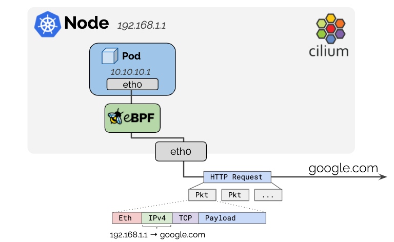
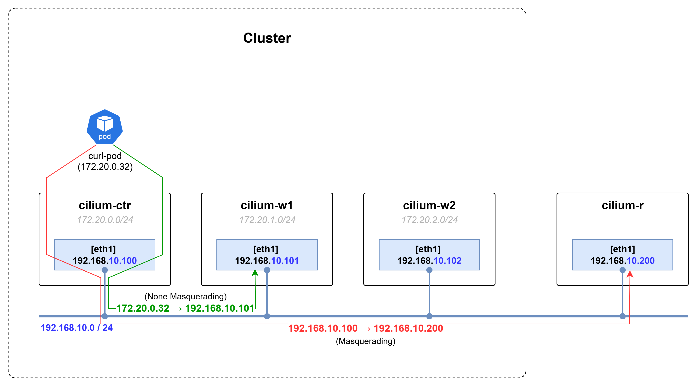
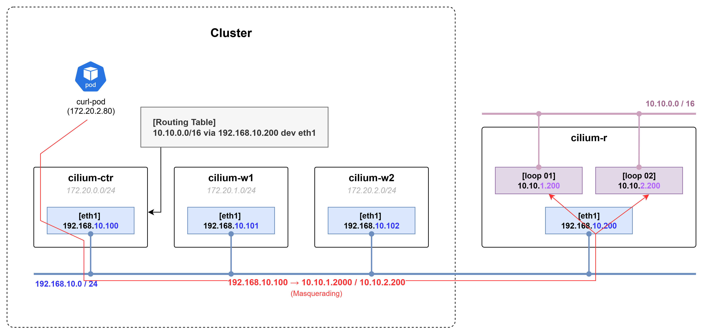
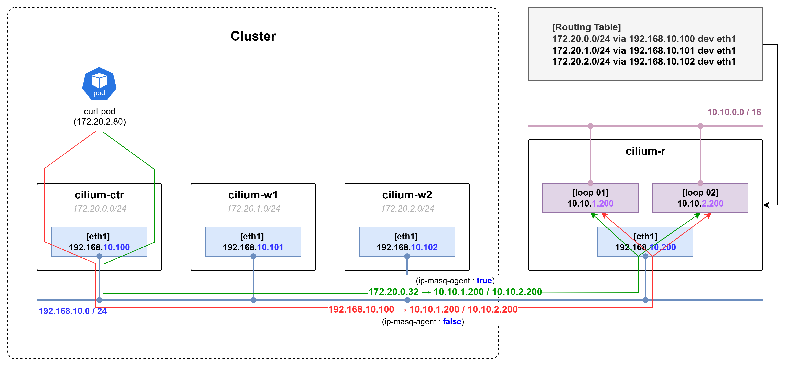

# Cluster 외부 통신에 사용되는 Masquerading



- 쿠버네티스 클러스터 내부에서는 Private Address를 사용하기 때문에 Public Address로 NAT 없이 외부 네트워크와 통신할 수 없다.
- 외부 네트워크와의 통신을 지원하기 위해 파드에서 클러스터 외부로 나가는 트래픽은 Source IP 주소를 Host Node의 IP 주소로 Masquerading 한다.
- Cilium 설치 옵션에서 지정한 ipv4-native-routing-cidr 범위를 벗어난 IP 주소로 향하는 모든 패킷은 Masquerading 처리 된다.
  - 설정되어 있는  ipv4-native-routing-cidr 정보 조회 명령어
    ```bash
    root@cilium-ctr:~# cilium config view | grep native
    ipv4-native-routing-cidr                          172.20.0.0/16
    routing-mode                                      native
    ```
  - 노드 간의 통신에는 Encapsulation(VxLAN, Geneve), Native Routing 방식을 사용하고, Cluster를 떠나는 트래픽에 대한 Masquerade 만 지원된다.
- Cilium은 Masquerading 방식으로 eBPF(default), iptables 방식 두 가지를 지원한다.
  ```bash
  root@cilium-ctr:~# c0 status | grep Masquerading
  Masquerading:            BPF   [eth0, eth1]   172.20.0.0/16  [IPv4: Enabled, IPv6: Disabled]
  ```
- 클러스터 외부로 나가는 트래픽이지만 통신 과정에 Pod IP를 유지하고 싶은 경우 ip-masq-agent 옵션을 설정할 수도 있다. → BGP, Static Routing 추가 설정 필요

# Masquerading 통신 테스트

## 1. 동일 네트워크에 속한 클러스터 외부 호스트와의 통신

### 1.1  Kubernetes Cluster Diagram


```bash
oot@cilium-ctr:~# for i in ctr r ; do echo ">> node : cilium-$i <<"; sshpass -p 'vagrant' ssh -o StrictHostKeyChecking=no vagrant@cilium-$i ip -c -br route show | grep "192.168" | grep -vE '10.10.0.0|172.20'; echo; done
>> node : cilium-ctr <<
192.168.10.0/24 dev eth1 proto kernel scope link src 192.168.10.100 
192.168.20.0/24 via 192.168.10.200 dev eth1 proto static 

>> node : cilium-r <<
192.168.10.0/24 dev eth1 proto kernel scope link src 192.168.10.200 
192.168.20.0/24 dev eth2 proto kernel scope link src 192.168.20.200
```

### 1.2  통신 테스트

- 클러스터와 같은 네트워크에 속하지만 클러스터에 Join되지 않은 호스트(cilium-r) 간의 통신 과정에 curl-pod에서 Source IP가 호스트 노드의 IP로 변경되는지 테스트를 진행한다.
- curl-pod에서 router 노드(cilium-r)로 패킷을 보내면 Source IP 정보가 Host IP로 Masquerading 되어 통신하고 있는 것을 확인할 수 있다.

  ```bash
  # NOTE:: Ping 패킷 보내기
  root@cilium-ctr:~# kubectl exec -it curl-pod-01 -- ping -c 1 192.168.10.200
  PING 192.168.10.200 (192.168.10.200) 56(84) bytes of data.
  64 bytes from 192.168.10.200: icmp_seq=1 ttl=63 time=0.313 ms

  --- 192.168.10.200 ping statistics ---
  1 packets transmitted, 1 received, 0% packet loss, time 0ms
  rtt min/avg/max/mdev = 0.313/0.313/0.313/0.000 ms
  ```

  ```bash
  # NOTE:: tcpdump 결과 (cilium-ctr)
  root@cilium-ctr:~# tcpdump -i any icmp -nnq
  tcpdump: data link type LINUX_SLL2
  tcpdump: verbose output suppressed, use -v[v]... for full protocol decode
  listening on any, link-type LINUX_SLL2 (Linux cooked v2), snapshot length 262144 bytes
  15:39:01.804375 lxcaa459a956e4d In  IP 172.20.0.32 > 192.168.10.200: ICMP echo request, id 23, seq 1, length 64
  15:39:01.804456 eth1  Out IP 192.168.10.100 > 192.168.10.200: ICMP echo request, id 23, seq 1, length 64
  15:39:01.804674 eth1  In  IP 192.168.10.200 > 192.168.10.100: ICMP echo reply, id 23, seq 1, length 64
  ```

  ```bash
  # NOTE:: tcpdump 결과 (cilium-r)
  root@cilium-r:~# tcpdump -i any icmp -nnq
  tcpdump: data link type LINUX_SLL2
  tcpdump: verbose output suppressed, use -v[v]... for full protocol decode
  listening on any, link-type LINUX_SLL2 (Linux cooked v2), snapshot length 262144 bytes
  15:39:01.805006 eth1  In  IP 192.168.10.100 > 192.168.10.200: ICMP echo request, id 23, seq 1, length 64
  15:39:01.805044 eth1  Out IP 192.168.10.200 > 192.168.10.100: ICMP echo reply, id 23, seq 1, length 64
  ```

- curl-pod에서 클러스터 내부에 속한 cilium-w1 워커 노드로 패킷을 보내면 Source IP 정보 변경 없이 Pod의 IP로 통신한다.

  ```bash
  # NOTE:: Ping 패킷 보내기
  root@cilium-ctr:~# kubectl exec -it curl-pod-01 -- ping -c 1 192.168.10.101
  PING 192.168.10.101 (192.168.10.101) 56(84) bytes of data.
  64 bytes from 192.168.10.101: icmp_seq=1 ttl=63 time=0.301 ms
  ```

  ```bash
  # NOTE:: tcpdump 결과 (cilium-ctr)
  root@cilium-w1:~# tcpdump -i any icmp -nnq
  tcpdump: data link type LINUX_SLL2
  tcpdump: verbose output suppressed, use -v[v]... for full protocol decode
  listening on any, link-type LINUX_SLL2 (Linux cooked v2), snapshot length 262144 bytes
  15:45:23.560346 eth1  In  IP 172.20.0.32 > 192.168.10.101: ICMP echo request, id 35, seq 1, length 64
  15:45:23.560399 eth1  Out IP 192.168.10.101 > 172.20.0.32: ICMP echo reply, id 35, seq 1, length 64
  ```

## 2. 다른 네트워크에 속한 클러스터 외부 호스트와의 통신

### 2.1  Kubernetes Cluster Diagram



- 클러스터 외부 네트워크 중 Public Address 범위가 아닌 사내 다른 시스템과의 네트워크 통신이 필요한 경우를 가정하고 통신 테스트를 진행한다.
- 사내 다른 시스템 네트워크는 10.10.1.0/24, 10.10.2.0/24 대역으로 가정하고 cilium-r 노드의 dummy interface를 할당해서 테스트한다.

  ```bash
  root@cilium-r:~# ip -c -br -4 addr
  lo               UNKNOWN        127.0.0.1/8 
  eth0             UP             10.0.2.15/24 metric 100 
  eth1             UP             192.168.10.200/24 
  eth2             UP             192.168.20.200/24 
  loop1            UNKNOWN        10.10.1.200/24 
  loop2            UNKNOWN        10.10.2.200/24 
  ```

- 클러스터 내부 노드는 사내 시스템 네트워크로 라우팅할 수 있게 정보를 추가한다. → BGP or Static Routing 설정 필요

  ```bash
  root@cilium-ctr:~# ip -c route | grep static
  10.10.0.0/16 via 192.168.10.200 dev eth1 proto static 
  ```

### 2.2 통신 테스트

- curl-pod에서 사내 시스템으로 통신을 시도하면 Masquerading 처리 후 통신 되고 있는 것을 확인할 수 있다.

  ```bash
  # NOTE:: HTTP 패킷 보내기
  root@cilium-ctr:~#  kubectl exec -it curl-pod-01 -- curl -s 10.10.1.200
  <h1>Web Server : cilium-r</h1>
  ```

  ```bash
  # NOTE:: tcpdump 결과 (cilium-ctr)
  root@cilium-ctr:~# tcpdump -i any tcp port 80 -nnq
  tcpdump: data link type LINUX_SLL2
  tcpdump: verbose output suppressed, use -v[v]... for full protocol decode
  listening on any, link-type LINUX_SLL2 (Linux cooked v2), snapshot length 262144 bytes
  16:19:00.758912 lxcaa459a956e4d In  IP 172.20.0.32.43042 > 10.10.1.200.80: tcp 0
  16:19:00.758944 eth1  Out IP 192.168.10.100.43042 > 10.10.1.200.80: tcp 0
  16:19:00.759182 eth1  In  IP 10.10.1.200.80 > 192.168.10.100.43042: tcp 0
  16:19:00.759220 lxcaa459a956e4d In  IP 172.20.0.32.43042 > 10.10.1.200.80: tcp 0
  16:19:00.759227 eth1  Out IP 192.168.10.100.43042 > 10.10.1.200.80: tcp 0
  16:19:00.759434 lxcaa459a956e4d In  IP 172.20.0.32.43042 > 10.10.1.200.80: tcp 75
  16:19:00.759467 eth1  Out IP 192.168.10.100.43042 > 10.10.1.200.80: tcp 75
  16:19:00.759610 eth1  In  IP 10.10.1.200.80 > 192.168.10.100.43042: tcp 0
  16:19:00.759898 eth1  In  IP 10.10.1.200.80 > 192.168.10.100.43042: tcp 258
  16:19:00.759944 lxcaa459a956e4d In  IP 172.20.0.32.43042 > 10.10.1.200.80: tcp 0
  16:19:00.759949 eth1  Out IP 192.168.10.100.43042 > 10.10.1.200.80: tcp 0
  16:19:00.760074 lxcaa459a956e4d In  IP 172.20.0.32.43042 > 10.10.1.200.80: tcp 0
  16:19:00.760084 eth1  Out IP 192.168.10.100.43042 > 10.10.1.200.80: tcp 0
  16:19:00.760253 eth1  In  IP 10.10.1.200.80 > 192.168.10.100.43042: tcp 0
  16:19:00.760284 lxcaa459a956e4d In  IP 172.20.0.32.43042 > 10.10.1.200.80: tcp 0
  16:19:00.760303 eth1  Out IP 192.168.10.100.43042 > 10.10.1.200.80: tcp 0
  ```

  ```bash
  # NOTE:: tcpdump 결과 (cilium-r)
  root@cilium-r:~# tcpdump -i any tcp port 80 -nnq
  tcpdump: data link type LINUX_SLL2
  tcpdump: verbose output suppressed, use -v[v]... for full protocol decode
  listening on any, link-type LINUX_SLL2 (Linux cooked v2), snapshot length 262144 bytes
  16:19:00.759494 eth1  In  IP 192.168.10.100.43042 > 10.10.1.200.80: tcp 0
  16:19:00.759535 eth1  Out IP 10.10.1.200.80 > 192.168.10.100.43042: tcp 0
  16:19:00.759715 eth1  In  IP 192.168.10.100.43042 > 10.10.1.200.80: tcp 0
  16:19:00.759967 eth1  In  IP 192.168.10.100.43042 > 10.10.1.200.80: tcp 75
  16:19:00.759991 eth1  Out IP 10.10.1.200.80 > 192.168.10.100.43042: tcp 0
  16:19:00.760285 eth1  Out IP 10.10.1.200.80 > 192.168.10.100.43042: tcp 258
  16:19:00.760446 eth1  In  IP 192.168.10.100.43042 > 10.10.1.200.80: tcp 0
  16:19:00.760582 eth1  In  IP 192.168.10.100.43042 > 10.10.1.200.80: tcp 0
  16:19:00.760645 eth1  Out IP 10.10.1.200.80 > 192.168.10.100.43042: tcp 0
  16:19:00.760811 eth1  In  IP 192.168.10.100.43042 > 10.10.1.200.80: tcp 0
  ```

## 3. 다른 네트워크와 Masquerading 없이 통신이 필요할 경우 

### 3.1  Kubernetes Cluster Diagram



- [「2. 다른 네트워크에 속한 클러스터 외부 호스트와의 통신」](#2.-다른-네트워크에-속한-클러스터-외부-호스트와의-통신)에서 구성한 네트워크와 동일한 환경에서 테스트한다.
- 사내 시스템 네트워크는 cilium-r 노드에 10.10.1.0/24, 10.10.2.0/24 대역으로 dummy interface에 구성한다.
- 클러스터 내부 노드는 사내 시스템 네트워크로 라우팅 할 수 있게 정보를 추가한다. → BGP or Static Routing 설정 필요
- 사내 시스템 네트워크에서 Pod에 할당되는 CIDR 정보로 라우팅 할 수 없기 때문에 라우팅 정보를 추가한다. → BGP or Static Routing 설정 필요

  ```bash
  # NOTE:: 노드별 PodCIDR 조회
  root@cilium-ctr:~# kubectl get ciliumnode -o jsonpath='{range .items[*]}{.metadata.name}{" "}{.spec.ipam.podCIDRs[*]}{"\n"}{end}' | column -t
  cilium-ctr  172.20.0.0/24
  cilium-w1   172.20.1.0/24
  cilium-w2   172.20.2.0/24
  ```

  ```bash
  # NOTE:: cilium-r static routing 경로 설정
  root@cilium-r:~# ip route add 172.20.0.0/24 via 192.168.10.100
  root@cilium-r:~# ip route add 172.20.1.0/24 via 192.168.10.101
  root@cilium-r:~# ip route add 172.20.2.0/24 via 192.168.10.102
  ```

- Cilium에서 Masquerading 설정을 세부적으로 조정할 때는 ip-masq-agent 옵션을 사용한다.

### 3.2 ip-masq-agent을 이용한 Masquerading 세부 설정

- Cilium Agent CLI 이용 조회

```bash
root@cilium-ctr:~# c0 bpf ipmasq list
IP PREFIX/ADDRESS   
10.10.1.0/24             
10.10.2.0/24             
169.254.0.0/16      
```

- Cilium CLI 이용 조회

```bash
root@cilium-ctr:~# cilium config view | grep -i ip-mas
enable-ip-masq-agent                              true
```

- ip masquerading agent ConfigMap리소스 조회

```bash
root@cilium-ctr:~# kubectl get cm -n kube-system ip-masq-agent -o yaml 
apiVersion: v1
data:
  config: '{"nonMasqueradeCIDRs":["10.10.1.0/24","10.10.2.0/24"]}'
kind: ConfigMap
metadata:
  annotations:
    meta.helm.sh/release-name: cilium
    meta.helm.sh/release-namespace: kube-system
  creationTimestamp: "2025-09-09T07:44:29Z"
  labels:
    app.kubernetes.io/managed-by: Helm
  name: ip-masq-agent
  namespace: kube-system
  resourceVersion: "645230"
  uid: 98902c03-15e8-4c5b-9d06-83abee1ac2b4
```
### 3.4 통신 테스트

- curl-pod에서 사내 시스템으로 통신을 시도하면 Masquerading 없이 통신 되고 있는 것을 확인할 수 있다.

```bash
# NOTE:: HTTP 패킷 보내기
root@cilium-ctr:~#  kubectl exec -it curl-pod-01 -- curl -s 10.10.1.200
<h1>Web Server : cilium-r</h1>
```

```bash
# NOTE:: tcpdump 결과 (cilium-ctr)
root@cilium-ctr:~# tcpdump -i any tcp port 80 -nn
tcpdump: data link type LINUX_SLL2
tcpdump: verbose output suppressed, use -v[v]... for full protocol decode
listening on any, link-type LINUX_SLL2 (Linux cooked v2), snapshot length 262144 bytes
17:21:56.052126 lxcaa459a956e4d In  IP 172.20.0.32.49386 > 10.10.1.200.80: Flags [S], seq 3610080304, win 64240, options [mss 1460,sackOK,TS val 2175063139 ecr 0,nop,wscale 7], length 0
17:21:56.052153 eth1  Out IP 172.20.0.32.49386 > 10.10.1.200.80: Flags [S], seq 3610080304, win 64240, options [mss 1460,sackOK,TS val 2175063139 ecr 0,nop,wscale 7], length 0
17:21:56.052381 eth1  In  IP 10.10.1.200.80 > 172.20.0.32.49386: Flags [S.], seq 2388021094, ack 3610080305, win 65160, options [mss 1460,sackOK,TS val 2815076652 ecr 2175063139,nop,wscale 7], length 0
17:21:56.052423 lxcaa459a956e4d In  IP 172.20.0.32.49386 > 10.10.1.200.80: Flags [.], ack 1, win 502, options [nop,nop,TS val 2175063139 ecr 2815076652], length 0
17:21:56.052429 eth1  Out IP 172.20.0.32.49386 > 10.10.1.200.80: Flags [.], ack 1, win 502, options [nop,nop,TS val 2175063139 ecr 2815076652], length 0
17:21:56.052491 lxcaa459a956e4d In  IP 172.20.0.32.49386 > 10.10.1.200.80: Flags [P.], seq 1:76, ack 1, win 502, options [nop,nop,TS val 2175063139 ecr 2815076652], length 75: HTTP: GET / HTTP/1.1
17:21:56.052501 eth1  Out IP 172.20.0.32.49386 > 10.10.1.200.80: Flags [P.], seq 1:76, ack 1, win 502, options [nop,nop,TS val 2175063139 ecr 2815076652], length 75: HTTP: GET / HTTP/1.1
17:21:56.052610 eth1  In  IP 10.10.1.200.80 > 172.20.0.32.49386: Flags [.], ack 76, win 509, options [nop,nop,TS val 2815076652 ecr 2175063139], length 0
17:21:56.052875 eth1  In  IP 10.10.1.200.80 > 172.20.0.32.49386: Flags [P.], seq 1:259, ack 76, win 509, options [nop,nop,TS val 2815076652 ecr 2175063139], length 258: HTTP: HTTP/1.1 200 OK
17:21:56.052896 lxcaa459a956e4d In  IP 172.20.0.32.49386 > 10.10.1.200.80: Flags [.], ack 259, win 501, options [nop,nop,TS val 2175063139 ecr 2815076652], length 0
17:21:56.052903 eth1  Out IP 172.20.0.32.49386 > 10.10.1.200.80: Flags [.], ack 259, win 501, options [nop,nop,TS val 2175063139 ecr 2815076652], length 0
17:21:56.053336 lxcaa459a956e4d In  IP 172.20.0.32.49386 > 10.10.1.200.80: Flags [F.], seq 76, ack 259, win 501, options [nop,nop,TS val 2175063140 ecr 2815076652], length 0
17:21:56.053346 eth1  Out IP 172.20.0.32.49386 > 10.10.1.200.80: Flags [F.], seq 76, ack 259, win 501, options [nop,nop,TS val 2175063140 ecr 2815076652], length 0
17:21:56.053517 eth1  In  IP 10.10.1.200.80 > 172.20.0.32.49386: Flags [F.], seq 259, ack 77, win 509, options [nop,nop,TS val 2815076653 ecr 2175063140], length 0
17:21:56.053553 lxcaa459a956e4d In  IP 172.20.0.32.49386 > 10.10.1.200.80: Flags [.], ack 260, win 501, options [nop,nop,TS val 2175063140 ecr 2815076653], length 0
17:21:56.053563 eth1  Out IP 172.20.0.32.49386 > 10.10.1.200.80: Flags [.], ack 260, win 501, options [nop,nop,TS val 2175063140 ecr 2815076653], length 0
```

```bash
# NOTE:: tcpdump 결과 (cilium-r)
root@cilium-r:~# tcpdump -i any tcp port 80 -nn
tcpdump: data link type LINUX_SLL2
tcpdump: verbose output suppressed, use -v[v]... for full protocol decode
listening on any, link-type LINUX_SLL2 (Linux cooked v2), snapshot length 262144 bytes
17:21:56.052710 eth1  In  IP 172.20.0.32.49386 > 10.10.1.200.80: Flags [S], seq 3610080304, win 64240, options [mss 1460,sackOK,TS val 2175063139 ecr 0,nop,wscale 7], length 0
17:21:56.052744 eth1  Out IP 10.10.1.200.80 > 172.20.0.32.49386: Flags [S.], seq 2388021094, ack 3610080305, win 65160, options [mss 1460,sackOK,TS val 2815076652 ecr 2175063139,nop,wscale 7], length 0
17:21:56.052921 eth1  In  IP 172.20.0.32.49386 > 10.10.1.200.80: Flags [.], ack 1, win 502, options [nop,nop,TS val 2175063139 ecr 2815076652], length 0
17:21:56.052986 eth1  In  IP 172.20.0.32.49386 > 10.10.1.200.80: Flags [P.], seq 1:76, ack 1, win 502, options [nop,nop,TS val 2175063139 ecr 2815076652], length 75: HTTP: GET / HTTP/1.1
17:21:56.053005 eth1  Out IP 10.10.1.200.80 > 172.20.0.32.49386: Flags [.], ack 76, win 509, options [nop,nop,TS val 2815076652 ecr 2175063139], length 0
17:21:56.053264 eth1  Out IP 10.10.1.200.80 > 172.20.0.32.49386: Flags [P.], seq 1:259, ack 76, win 509, options [nop,nop,TS val 2815076652 ecr 2175063139], length 258: HTTP: HTTP/1.1 200 OK
17:21:56.053385 eth1  In  IP 172.20.0.32.49386 > 10.10.1.200.80: Flags [.], ack 259, win 501, options [nop,nop,TS val 2175063139 ecr 2815076652], length 0
17:21:56.053835 eth1  In  IP 172.20.0.32.49386 > 10.10.1.200.80: Flags [F.], seq 76, ack 259, win 501, options [nop,nop,TS val 2175063140 ecr 2815076652], length 0
17:21:56.053896 eth1  Out IP 10.10.1.200.80 > 172.20.0.32.49386: Flags [F.], seq 259, ack 77, win 509, options [nop,nop,TS val 2815076653 ecr 2175063140], length 0
17:21:56.054053 eth1  In  IP 172.20.0.32.49386 > 10.10.1.200.80: Flags [.], ack 260, win 501, options [nop,nop,TS val 2175063140 ecr 2815076653], length 0
```

