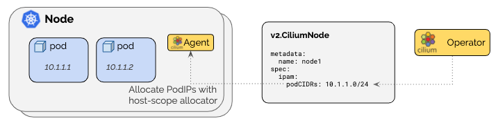
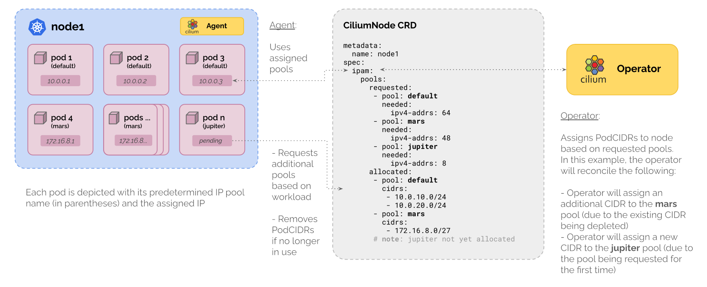

# 클러스터 내부 IP 관리를 위한 IPAM (IP Address Management)

| 기능 | Kubernetes Host Scop | Cluster Scope | Multi-Pool | CRD-backed | AWS ENI |                                                   
|---|:---:|:---:|:---:|:---:|:---:|                                                                                   
| **Tunnel routing** | ✅ | ✅ | ❌ | ❌ | ❌ |                                                                       
| **Direct routing** | ✅ | ✅ | ✅ | ✅ | ✅ |                                                                       
| **CIDR Configuration** | Kubnernetes | Cilium | Cilium | External | External(AWS) | 
| **Multiple CIDRs per cluster** | ❌ | ✅ | ✅ | N/A | N/A |                                                         
| **Multiple CIDRs per node** | ❌ | ❌ | ✅ | N/A | N/A |                                                            
| **Dynamic CIDR/IP allocation** | ❌ | ❌ | ✅ | ✅ | ✅ |

- 네트워크 엔드포인트(컨테이너 등)에서 사용할 IP 주소를 할당하고 관리하는 역할을 한다.
- IPAM 모드를 사용 중간에 변경하는 것은 권장되지 않는다. 새로운 쿠버네티스 클러스터를 생성하면서 IPAM 모드를 변경하는 것이 좋다.
- 배포 환경, 사용자의 요구사항에 따라 다양하게 구성이 가능하도록 7개의 배포 모드를 지원한다. - [ LINK ](https://docs.cilium.io/en/stable/network/concepts/ipam/)


# IPAM 설정

## 1. Kubernetes Host Scope


- Kubernetes Controller Manager가 클러스터 전체 CIDR을 각 노드에 PodCIDR로 분할·할당한다.
  - 클러스터 생성 시 kubeadm의 `--pod-network-cidr` 값이 kube-controller-manager의 `--cluster-cidr`로 자동 반영된다.
  - `kubeadm --pod-network-cidr` → `kube-controller-manager --cluster-cidr` → 각 노드 `PodCIDR`
- Cilium Agent는 해당 노드에 할당된 PodCIDR 범위 내에서 Pod에 IP를 할당한다.

```bash
root@cilium-ctr:~# kubectl describe pod -n kube-system kube-controller-manager-cilium-ctr | grep -A10 Command
    Command:
      kube-controller-manager
      --allocate-node-cidrs=true		# 이 값이 false로 되어 있으면 cluster-cidr은 무시된다.
      --authentication-kubeconfig=/etc/kubernetes/controller-manager.conf
      --authorization-kubeconfig=/etc/kubernetes/controller-manager.conf
      --bind-address=127.0.0.1
      --client-ca-file=/etc/kubernetes/pki/ca.crt
      --cluster-cidr=10.244.0.0/16		# --pod-network-cidr 파라미터 입력 값이 여기에 반영된다.
      --cluster-name=kubernetes
      --cluster-signing-cert-file=/etc/kubernetes/pki/ca.crt
      --cluster-signing-key-file=/etc/kubernetes/pki/ca.key
```      

- 구현이 간단하지만 CIDR 값을 유연하게 관리하는데 제약이 많다.
- 클러스터 전체에 1개의 cluster-cidr 구성만 가능하다.
- 클러스터 동작 중 cluster-cidr 설정 변경은 불가능하고 클러스터 재배포가 필요하다.
- 초기에 노드에 설정된 PodCIDR은 추가 할 수 없다.
- 노드의 PocCIDR 확장 절차 : 클러스터에서 노드 제거 → Kubernertes Controller Manager 설정 변경(node-cidr-mask-size) → 클러스터에 노드 join
- 이러한 특성 때문에 초기에 클러스터 배포 시 정확하게 노드별 IP 주소 계획을 수립해서 사용해야 한다.

## 2. Cluster Scope IPAM (default)



- Kubernetes Host Scope와 동일한 방식으로 동작하지만, 노드의 PodCIDR을 할당하는 주체가 Kubernetes Controller Manager가 아닌 Cilium Operator다.
- cluster-cidr을 여러 개로 설정할 수 있어 Kubernetes Host Scope보다 유연하다.
- 운영 중 CIDR의 IP가 고갈될 경우 동적으로 대응하지 못하는 제약은 동일하다.

### 2.1 Cluster Scope IPAM 설정 방법

- Helm install 옵션
```yaml
# cilium-values.yaml
# NOTE:: helm install cilium cilium/cilium -n kube-system --version 1.17.5 -f cilium-values.yaml
...
ipam:
  mode: cluster-pool			          # Cluster Scope IPAM 모드 지정
  operator:
    clusterPoolIPv4MaskSize: 29	    # 노드에 할당되는 PodCIDR Size
    clusterPoolIPv4PodCIDRList:	    # Cluster CIDR Size를 복수개로 설정할 때는 리스트 형태로 전달
      - "172.20.42.0/28"
      - "172.20.84.0/28"
...
```

- 배포 결과 확인
```bash
$ cilium config view | grep cluster-pool
cluster-pool-ipv4-cidr                            172.20.42.0/28 172.20.84.0/28
cluster-pool-ipv4-mask-size                       29
ipam                                              cluster-pool
```

- 노드에 반영된 PodCIDR 정보 확인 (Subnet Mask 값이 /29로 반영되어 있는지 확인)
```bash
$ kubectl get ciliumnode -o jsonpath='{range .items[*]}{.metadata.name}{" "}{.spec.ipam.podCIDRs[*]}{"\n"}{end}' | column -t
cilium-ctr  172.20.84.0/29
cilium-w1   172.20.42.0/29
cilium-w2   172.20.42.8/29
```

### 2.2 Cluster CIDR 추가
- Helm upgrade 명령 이용 10.0.0.0/28 CIDR 정보 추가 반영 후 배포
```yaml
# cilium-values.yaml
# NOTE:: helm upgrade cilium cilium/cilium -n kube-system --version 1.17.5 -f cilium-values.yaml
...
ipam:
  mode: cluster-pool
  operator:
    clusterPoolIPv4MaskSize: 29
    clusterPoolIPv4PodCIDRList:
      - "172.20.42.0/28"
      - "172.20.84.0/28"
      - "10.0.0.0/28"			    # Cluster CIDR 추가
...
```

- 배포 결과 확인
```bash
$ cilium config view | grep cluster-pool
cluster-pool-ipv4-cidr                            172.20.42.0/28 172.20.84.0/28 10.0.0.0/28
cluster-pool-ipv4-mask-size                       29
ipam                                              cluster-pool
```

### 2.3 PodCIDR의 IP가 고갈되었을 때 자동으로 확장되는지 테스트
- 클러스터 배포 완료 후 각 노드의 남아 있는 IP 개수를 확인한다. → 현재 워커노드 1, 2번은 IP 6개 중 3개를 사용중인 상태다.
```bash
$ c1dbg status | grep IPAM
IPAM:                    IPv4: 3/6 allocated from 172.20.42.0/29,
$ c2dbg status | grep IPAM
IPAM:                    IPv4: 3/6 allocated from 172.20.42.8/29,
```

- 파드 10개를 클러스터에 배포
```bash
$ kubectl create deployment netshoot --image nginx --replicas 10
deployment.apps/netshoot created
```

- 파드 상태를 조회하면 4개의 Pod가 ContainerCreating 상태로 대기 중인 것을 확인할 수 있다.
```bash
$ kubectl get po -o wide
NAME                        READY   STATUS              RESTARTS   AGE     IP             NODE        NOMINATED NODE   READINESS GATES
netshoot-5fbc6f4997-99djz   1/1     Running             0          2m34s   172.20.42.9    cilium-w2   <none>           <none>
netshoot-5fbc6f4997-9h945   1/1     Running             0          2m34s   172.20.42.10   cilium-w2   <none>           <none>
netshoot-5fbc6f4997-9h9vw   0/1     ContainerCreating   0          2m34s   <none>         cilium-w2   <none>           <none>
netshoot-5fbc6f4997-b9mdk   0/1     ContainerCreating   0          2m34s   <none>         cilium-w2   <none>           <none>
netshoot-5fbc6f4997-rdbg8   1/1     Running             0          2m34s   172.20.42.4    cilium-w1   <none>           <none>
netshoot-5fbc6f4997-t84kf   0/1     ContainerCreating   0          2m34s   <none>         cilium-w1   <none>           <none>
netshoot-5fbc6f4997-tq5tt   0/1     ContainerCreating   0          2m34s   <none>         cilium-w1   <none>           <none>
netshoot-5fbc6f4997-wpf8j   1/1     Running             0          2m34s   172.20.42.1    cilium-w1   <none>           <none>
netshoot-5fbc6f4997-xjft8   1/1     Running             0          2m34s   172.20.42.11   cilium-w2   <none>           <none>
netshoot-5fbc6f4997-zxzfs   1/1     Running             0          2m34s   172.20.42.6    cilium-w1   <none>           <none>
```

- ContainerCreating 상태의 파드 중 하나의 이벤트 정보를 조회하면 CiliumPlugin 을 통해 IP주소를 가져오지 못하고 range is full 메시지를 반환하고 있음을 확인할 수 있다.

```bash
$ kubectl describe po netshoot-5fbc6f4997-tq5tt  | grep -A10 Events
Events:
  Type     Reason                  Age                  From               Message
  ----     ------                  ----                 ----               -------
  Normal   Scheduled               5m31s                default-scheduler  Successfully assigned default/netshoot-5fbc6f4997-tq5tt to cilium-w1
  Warning  FailedCreatePodSandBox  5m30s                kubelet            Failed to create pod sandbox: rpc error: code = Unknown desc = failed to setup network for sandbox "d0146b59d6be4c9e7fdd3e2d1fbba7b999d4c8bddf99f9248168bea00062d0d8": plugin type="cilium-cni" failed (add): unable to allocate IP via local cilium agent: [POST /ipam][502] postIpamFailure "range is full"
  ...
```

- 각 노드에 남아 있는 IP 개수를 확인한다. →  6/6으로 모두 소진되었고, 자동으로 PodCIDR이 확장되지는 않았음을 확인할 수 있다.
```bash
$ c1dbg status | grep IPAM
IPAM:                    IPv4: 6/6 allocated from 172.20.42.0/29
$ c2dbg status | grep IPAM
IPAM:                    IPv4: 6/6 allocated from 172.20.42.8/29,
```

## 3. Multi Pool IPAM



- cluster-cidr과 pod-cidr을 여러 개로 지정할 수 있다. 
- 운영 중 노드에 할당된 PodCIDR이 고갈되면 Cluster CIDR로 설정된 범위 내에서 자동으로 IP Pool을 노드에 추가한다.

### 3.1 Multi Pool IPAM 설정 방법

- Helm install 옵션
```yaml
# cilium-values.yaml
# NOTE:: helm install cilium cilium/cilium -n kube-system --version 1.17.5 -f cilium-values.yaml
ipam:
  mode: multi-pool
  operator:
    autoCreateCiliumPodIPPools:
      default:
        ipv4:
          cidrs: 172.20.0.0/16
          maskSize: 28
```

- 배포 결과 확인
```bash
$ cilium config view | grep multi-pool
ipam                                              multi-pool
$ cilium config view | grep auto-create
auto-create-cilium-pod-ip-pools                   default=ipv4-cidrs:172.20.0.0/16;ipv4-mask-size:28
```

- 노드에 할당된 CIDR 정보 확인
```bash
$ for i in ctr w1 w2 ; do echo ">> node : cilium-$i <<"; kubectl get ciliumnodes cilium-$i -o yaml | yq .spec.ipam.pools.allocated ; echo; done
>> node : cilium-ctr <<
[
  {
    "cidrs": [
      "172.20.0.0/28",
      "172.20.0.16/28"
    ],
    "pool": "default"
  }
]

>> node : cilium-w1 <<
[
  {
    "cidrs": [
      "172.20.0.48/28",
      "172.20.0.80/28"
    ],
    "pool": "default"
  }
]

>> node : cilium-w2 <<
[
  {
    "cidrs": [
      "172.20.0.32/28",
      "172.20.0.64/28"
    ],
    "pool": "default"
  }
]
```

### 3.2 IP Pool 추가

- helm 배포 시 사용한 values.yaml 파일 수정 후 재배포 하는 방식도 가능하지만, CiliumPodIPPool 리소스를 생성해 배포해도 CIDR 정보를 추가할 수 있다.
```yaml
# cilium_ip_pool_a.yaml
apiVersion: cilium.io/v2alpha1
kind: CiliumPodIPPool
metadata:
  name: pool-a
spec:
  ipv4:
    cidrs:
      - 10.100.0.0/16
    maskSize: 29
---
# cilium_ip_pool_b.yaml
apiVersion: cilium.io/v2alpha1
kind: CiliumPodIPPool
metadata:
  name: pool-b
spec:
  ipv4:
    cidrs:
      - 10.200.0.0/16
    maskSize: 29
```
```bash
kubectl apply -f cilium_ip_pool_a.yaml
kubectl apply -f cilium_ip_pool_b.yaml
```

### 3.3 Pod에서 사용할 IP Pool을 지정해서 생성하는 방법

- Pod에 annotation 설정이 없으면 default ip pool이 사용된다.
- annotation 설정 없이 배포한 결과 default ip pool (`172.20.0.0/16`) 이 사용된 것을 확인할 수 있다.
```bash
# annotaion 지정 없이 deployment 생성
$ kubectl create deployment netshoot --image nginx --replicas 2		
$ kubectl get po -owide
NAME                        READY   STATUS    RESTARTS   AGE   IP            NODE        NOMINATED NODE   READINESS GATES
netshoot-5fbc6f4997-2dd4z   1/1     Running   0          92s   172.20.0.77   cilium-w2   <none>           <none>
netshoot-5fbc6f4997-4tmch   1/1     Running   0          92s   172.20.0.89   cilium-w1   <none>           <none>
```

- `CiliumPodIPPool`로 배포된 IP Pool `pool-a`, `pool-b` 지정해서 배포하면 다른 IP CIDR 을 할당하게 된다.
```yaml
# deploy_pool-a.yaml              
apiVersion: apps/v1
kind: Deployment                                                                                                      
metadata:
  name: nginx-a                                                                                                  
spec:                
  selector:                                                                                                           
    matchLabels:
      app: nginx-a                                                                                               
  replicas: 2        
  template:
    metadata:
      labels:
        app: nginx-a
      annotations:
        ipam.cilium.io/ip-pool: pool-a # ip pool name 지정
    spec:                                                                                                             
      containers:
        - name: nginx                                                                                                 
          image: nginx
          ports:
            - containerPort: 80
---
# deploy_pool-b.yaml
apiVersion: apps/v1
kind: Deployment                                                                                                      
metadata:
  name: nginx-b                                                                                                  
spec:                
  selector:
    matchLabels:
      app: nginx-b
  replicas: 2
  template:
    metadata:
      labels:
        app: nginx-b
      annotations:                                                                                                    
        ipam.cilium.io/ip-pool: pool-b # ip pool name 지정
    spec:                                                                                                             
      containers:    
        - name: nginx
          image: nginx
          ports:
            - containerPort: 80
```

- 배포 결과 확인 → Pod 마다 다른 CIDR이 사용되고 있는 것을 확인할 수 있다.
```bash
$ kubectl get pods -o wide
NAME                         READY   STATUS    RESTARTS   AGE     IP            NODE        NOMINATED NODE   READINESS GATES
netshoot-5fbc6f4997-2dd4z    1/1     Running   0          6m19s   172.20.0.77   cilium-w2   <none>           <none>
netshoot-5fbc6f4997-4tmch    1/1     Running   0          6m19s   172.20.0.89   cilium-w1   <none>           <none>
nginx-a-65889dbdc9-75rr6     1/1     Running   0          82s     10.100.0.14   cilium-w2   <none>           <none>
nginx-a-65889dbdc9-dsp56     1/1     Running   0          82s     10.100.0.6    cilium-w1   <none>           <none>
nginx-b-76df566dfb-4kfpx     1/1     Running   0          20s     10.200.0.11   cilium-w1   <none>           <none>
nginx-b-76df566dfb-d6v2j     1/1     Running   0          20s     10.200.0.3    cilium-w2   <none>           <none>
```

### 3.4 PodCIDR 자동 확장 테스트
- 노드에 할당된 PodCIDR 정보 확인
```bash
$ for i in ctr w1 w2 ; do echo ">> node : cilium-$i <<"; kubectl get ciliumnodes cilium-$i -o yaml | yq .spec.ipam.pools.allocated ; echo; done
>> node : cilium-ctr <<                                                                                               
...                                                                                                                   
                                                                                                                      
>> node : cilium-w1 <<                                                                                                
[                    
  ...
  {
    "cidrs": [
      "10.200.0.8/29"
    ],
    "pool": "pool-b"
  },                                                                                                                  
  {
    "cidrs": [                                                                                                        
      "10.100.0.0/29"
    ],
    "pool": "pool-a"
  }
]

>> node : cilium-w2 <<
[
  ...
  {
    "cidrs": [                                                                                                        
      "10.200.0.0/29"
    ],                                                                                                                
    "pool": "pool-b" 
  },
  {
    "cidrs": [
      "10.100.0.8/29"
    ],
    "pool": "pool-a"
  }                                                                                                                   
]
```

- 노드에 설정된 `pool-a`는 `/29` 마스크로 설정되어 있다. → 8개의 IP가 할당 가능한 상태에서 20개의 파드가 배포될 경우 자동으로 확장되는지 테스트 한다.

```bash
$ kubectl scale deployment nginx-a --replicas=20
```

- 노드에 할당된 PodCIDR 정보를 다시 확인한다. → 추가된 CIDR 정보를 확인할 수 있다.
```bash
$ for i in ctr w1 w2 ; do echo ">> node : cilium-$i <<"; kubectl get ciliumnodes cilium-$i -o yaml | yq .spec.ipam.pools.allocated ; echo; done
>> node : cilium-ctr <<                                                                                               
...
                                                                                                                      
>> node : cilium-w1 <<
[                                                                                                                     
  ...                
  {
    "cidrs": [
      "10.200.0.8/29"
    ],
    "pool": "pool-b"
  },
  {
    "cidrs": [
      "10.100.0.0/29",                                                                                                
      "10.100.0.16/29"  # 추가된 cidr
    ],                                                                                                                
    "pool": "pool-a" 
  }
]

>> node : cilium-w2 <<                                                                                                
[
  ...                                                                                                                 
  {                  
    "cidrs": [
      "10.200.0.0/29"
    ],
    "pool": "pool-b"
  },
  {
    "cidrs": [
      "10.100.0.24/29",   # 추가된 cidr
      "10.100.0.8/29"                                                                                                 
    ],
    "pool": "pool-a"                                                                                                  
  }                  
]
```

- Pod 목록을 조회하면 모든 파드가 정상 배포 된 것을 확인할 수 있다.
```bash
$ kubectl get po -owide
NAME                        READY   STATUS    RESTARTS   AGE     IP            NODE        NOMINATED NODE   READINESS GATES
netshoot-5fbc6f4997-2dd4z   1/1     Running   0          14m     172.20.0.77   cilium-w2   <none>           <none>
netshoot-5fbc6f4997-4tmch   1/1     Running   0          14m     172.20.0.89   cilium-w1   <none>           <none>    
nginx-b-76df566dfb-4kfpx    1/1     Running   0          8m30s   10.200.0.11   cilium-w1   <none>           <none>    
nginx-b-76df566dfb-d6v2j    1/1     Running   0          8m30s   10.200.0.3    cilium-w2   <none>           <none>    
nginx-a-65889dbdc9-2fz58    1/1     Running   0          39s     10.100.0.28   cilium-w2   <none>           <none>    
nginx-a-65889dbdc9-4h48r    1/1     Running   0          6m51s   10.100.0.1    cilium-w1   <none>           <none>    
nginx-a-65889dbdc9-75rr6    1/1     Running   0          9m32s   10.100.0.14   cilium-w2   <none>           <none>    
nginx-a-65889dbdc9-7q2zr    1/1     Running   0          39s     10.100.0.30   cilium-w2   <none>           <none>    
nginx-a-65889dbdc9-96bcx    1/1     Running   0          6m51s   10.100.0.13   cilium-w2   <none>           <none>    
nginx-a-65889dbdc9-9jfcp    1/1     Running   0          6m51s   10.100.0.11   cilium-w2   <none>           <none>    
nginx-a-65889dbdc9-bdj98    1/1     Running   0          39s     10.100.0.22   cilium-w1   <none>           <none>    
nginx-a-65889dbdc9-bttzt    1/1     Running   0          39s     10.100.0.20   cilium-w1   <none>           <none>    
nginx-a-65889dbdc9-chbhz    1/1     Running   0          6m51s   10.100.0.10   cilium-w2   <none>           <none>    
nginx-a-65889dbdc9-ck4q8    1/1     Running   0          39s     10.100.0.27   cilium-w2   <none>           <none>    
nginx-a-65889dbdc9-cqgmd    1/1     Running   0          6m51s   10.100.0.2    cilium-w1   <none>           <none>    
nginx-a-65889dbdc9-dsp56    1/1     Running   0          9m32s   10.100.0.6    cilium-w1   <none>           <none>    
nginx-a-65889dbdc9-jlchn    1/1     Running   0          39s     10.100.0.9    cilium-w2   <none>           <none>    
nginx-a-65889dbdc9-l2nz5    1/1     Running   0          39s     10.100.0.29   cilium-w2   <none>           <none>    
nginx-a-65889dbdc9-ncsmb    1/1     Running   0          39s     10.100.0.21   cilium-w1   <none>           <none>    
nginx-a-65889dbdc9-nr7zv    1/1     Running   0          6m51s   10.100.0.3    cilium-w1   <none>           <none>    
nginx-a-65889dbdc9-rggpj    1/1     Running   0          6m51s   10.100.0.12   cilium-w2   <none>           <none>    
nginx-a-65889dbdc9-s9s6w    1/1     Running   0          39s     10.100.0.4    cilium-w1   <none>           <none>    
nginx-a-65889dbdc9-vn4bv    1/1     Running   0          39s     10.100.0.17   cilium-w1   <none>           <none>    
nginx-a-65889dbdc9-xsz9h    1/1     Running   0          6m51s   10.100.0.5    cilium-w1   <none>           <none> 
```

## 4. Load Balancer IPAM
- LoadBalancer IPAM은 Cilium이 LoadBalancer 타입의 서비스에 외부 IP를 할당할 수 있게 해주는 기능이다.
- 일반적으로 클라우드 환경에서는 CSP가 제공하는 기능을 사용하고, 온프레미스 환경에서는 MetalLB와 같은 별도 플러그인을 사용하지만, Cilium은 이 기능을 기본으로 내장하고 있다.
- LoadBalancer IPAM은 Cilium BGP Control Plane 또는 L2 Announcements 기능과 함께 동작한다.
  - IPAM은 LoadBalancer Type의 서비스에 IP를 할당하는 역할만 수행한다. 
  - Cilium BGP Control Plane, L2 Announcements은 할당된 IP 주소를 클러스터 외부에 광고하는 역할을 수행한다.

### 4.1 Load Balancer IP Pool 생성
- CiliumLoadBalancerIPPool 리소스를 통해 LB에 할당할 IP Pool을 생성할 수 있다.
```yaml
# lb-ip-pool.yaml
apiVersion: "cilium.io/v2alpha1"
kind: CiliumLoadBalancerIPPool
metadata:
  name: lb-ip-pool
spec:
  # allowFirstLastIPs: "No"
  blocks:
    - cidr: 192.168.10.240/28
  # - cidr: "2004::0/112"		# IPv6 유형도 지원
  # - start: "192.168.10.240"	# Prefix 방식이 아닌 start/stop 형식도 지원
  #   stop: "192.168.10.255"
```  

- 배포되어 있는 테스트용 webpod의 Service 타입을 ClusterIP → LoadBalancer로 변경 후 IP가 할당되는지 확인한다.
```bash
root@cilium-ctr:~/workspace# kubectl patch svc webpod -p '{"spec":{"type":"LoadBalancer"}}'
---
root@cilium-ctr:~/workspace#  kubectl  get svc
NAME         TYPE           CLUSTER-IP      EXTERNAL-IP      PORT(S)        AGE
kubernetes   ClusterIP      10.96.0.1       <none>           443/TCP        23d
webpod       LoadBalancer   10.96.177.238   192.168.10.240   80:30529/TCP   20d
```

- 아직은 LB External IP를 광고하기 위한 L2 Announcements, BGP Control Plane은 생성하지 않았지만 클러스터 내부에서는 통신이 가능하다.
```bash
root@cilium-ctr:~/workspace# curl 192.168.10.240
Hostname: webpod-697b545f57-tw2qs
IP: 127.0.0.1
IP: ::1
IP: 172.20.1.141
IP: fe80::8c5a:4eff:fed3:8741
RemoteAddr: 192.168.10.100:59474
GET / HTTP/1.1
Host: 192.168.10.240
User-Agent: curl/8.5.0
Accept: */*
---
root@cilium-ctr:~/workspace# kubectl exec -it curl-pod-01 -- curl -s 192.168.10.240
Hostname: webpod-697b545f57-nh85d
IP: 127.0.0.1
IP: ::1
IP: 172.20.2.23
IP: fe80::d4a6:6cff:fe46:5c76
RemoteAddr: 172.20.0.17:57692
GET / HTTP/1.1
Host: 192.168.10.240
User-Agent: curl/8.14.1
Accept: */*
```

- 클러스터 외부에 있는 서버에서 패킷을 보내면 통신이 되지 않는다. 
```bash
root@cilium-r:~# ip -c -br addr
lo               UNKNOWN        127.0.0.1/8 ::1/128 
eth0             UP             10.0.2.15/24 metric 100 fd17:625c:f037:2:a00:27ff:fe6b:69c9/64 fe80::a00:27ff:fe6b:69c9/64 
eth1             UP             192.168.10.200/24 fe80::a00:27ff:feb7:2f24/64 
eth2             UP             192.168.20.200/24 fe80::a00:27ff:feda:f2ae/64 
---
root@cilium-r:~# curl 192.168.10.240
curl: (7) Failed to connect to 192.168.10.240 port 80 after 3058 ms: Couldn't connect to server
```

- ARP Ping 테스트 후 ARP 테이블을 확인하면 목적지 IP(192.168.10.240)의 MAC 주소를 확인하지 못하고 incomplete 값이 기록되는 것을 확인할 수 있다.
```bash
root@cilium-r:~# arping -i eth1 192.168.10.240 -c 1
ARPING 192.168.10.240
Timeout

--- 192.168.10.240 statistics ---
1 packets transmitted, 0 packets received, 100% unanswered (0 extra)
---
root@cilium-r:~# arp -a
? (192.168.10.240) at <incomplete> on eth1
? (192.168.20.100) at 08:00:27:c4:91:ae [ether] on eth2
? (192.168.10.101) at 08:00:27:b9:4e:51 [ether] on eth1
? (192.168.10.100) at 08:00:27:ce:c1:d0 [ether] on eth1
? (192.168.10.102) at 08:00:27:b4:49:ef [ether] on eth1
_gateway (10.0.2.2) at 52:55:0a:00:02:02 [ether] on eth0
? (10.0.2.3) at 52:55:0a:00:02:03 [ether] on eth0
Workspace (192.168.10.1) at 0a:00:27:00:00:00 [ether] on eth1
```

### 4.2 L2 Announcements 생성
-  l2announcements, externalIPs 옵션 활성화
```yaml
# cilium-values.yaml
# NOTE:: helm upgrade cilium cilium/cilium -n kube-system --version 1.17.5 -f cilium-values.yaml
...
kubeProxyReplacement: true
autoDirectNodeRoutes: true
l2announcements:
  enabled: true
externalIPs:
  enabled: true
...
```

- 배포 결과 확인
```bash
$ cilium config view | grep enable-l2
enable-l2-announcements                           true
enable-l2-neigh-discovery                         true
```

- External IP에 대한 ARP 요청에 응답할 수 있도록 `CiliumL2AnnouncementPolicy`를 생성한다.
```yaml
# cilium-l2-announcement-policy.yaml
apiVersion: "cilium.io/v2alpha1"
kind: CiliumL2AnnouncementPolicy
metadata:
  name: cilium-l2-announcement-policy
spec:
  externalIPs: true
  loadBalancerIPs: true
```
```bash
kubectl apply -f cilium-l2-announcement-policy.yaml
```

- 배포 후 클러스터 외부 서버에서 다시 패킷을 보내면 응답이 오는 것을 확인할 수 있다.
```bash
root@cilium-ctr:~# k get svc
NAME         TYPE           CLUSTER-IP      EXTERNAL-IP      PORT(S)        AGE
kubernetes   ClusterIP      10.96.0.1       <none>           443/TCP        25d
webpod       LoadBalancer   10.96.177.238   192.168.10.240   80:30529/TCP   21d
---
root@cilium-r:~# curl 192.168.10.240
Hostname: webpod-697b545f57-tw2qs
IP: 127.0.0.1
IP: ::1
IP: 172.20.1.141
IP: fe80::8c5a:4eff:fed3:8741
RemoteAddr: 192.168.10.102:42588
GET / HTTP/1.1
Host: 192.168.10.240
User-Agent: curl/8.5.0
Accept: */*
```


