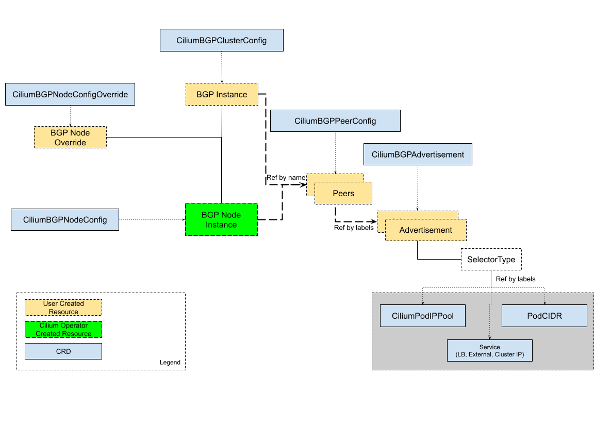
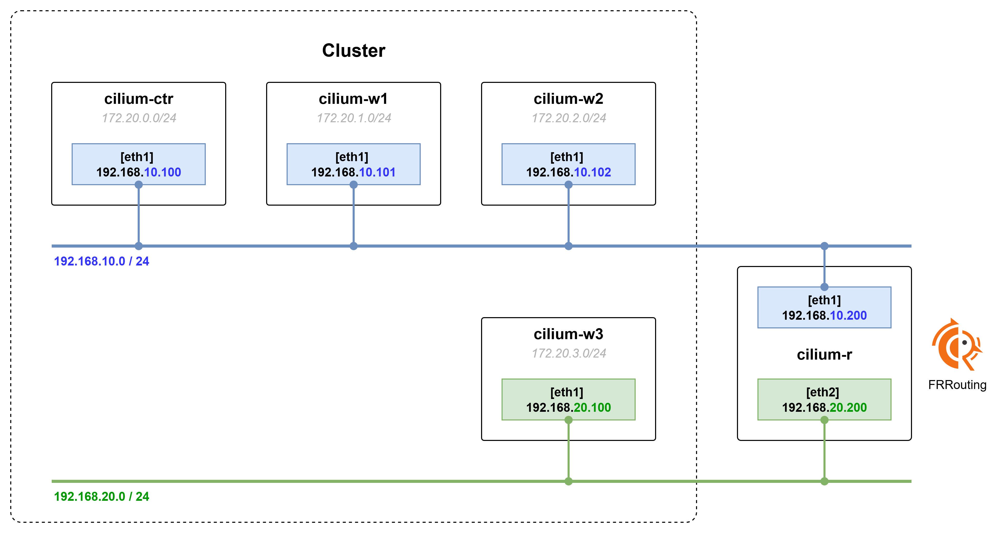

# Cilium BGP Control Plane



BGP를 이용해 연결된 라우터에 클러스터 내부 리소스(Pod, Service)로 접근하는 경로 정보를 광고할 수 있다.  
클러스터 외부에서 내부 리소스로 접근하는 네트워크 설정에 사용될 뿐 클러스터 내부 Datapath에는 활용될 수 없다.  
Cilium Agent가 BGP Daemon을 관리하고, CiliumBGPClusterConfig의 내용을 기반으로 BGP 네트워크를 설정한다.

## 주요 구성요소

| 리소스 | 설명 |
|---|---|
| `CiliumBGPClusterConfig` | 여러 노드에 적용되는 BGP 인스턴스와 피어 구성을 정의 |
| `CiliumBGPPeerConfig` | 여러 피어에서 사용하는 공통적인 BGP 피어링 설정 |
| `CiliumBGPAdvertisement` | BGP 라우팅 테이블에 삽입되는 접두사를 정의 |
| `CiliumBGPNodeConfigOverride` | 노드별 BGP 구성을 정의하여 더욱 세부적인 제어를 제공 |

## BGP Control Plane을 이용한 네트워크 구성 테스트

### 1. Kubernetes Cluster Diagram



- 4대의 가상머신(`cilium-ctr`, `cilium-w1~w3`)은 하나의 클러스터에 구성된 노드들이다.
- `cilium-ctr`, `cilium-w1~2` 노드는 `192.168.10.0/24` 대역에 구성되고, `cilium-w3` 노드만 `192.168.20.0/24` 대역에 구성된다.
- `cilium-r` 가상머신은 `192.168.10.0/24` 대역과 `192.168.20.0/24` 대역 라우팅을 지원하는 라우터 역할을 담당하고, 클러스터에 join 되어 있지 않다.
- `cilium-r` 가상머신은 라우터로서 BGP 라우팅 처리를 위해 FRRouting을 사용한다.
- BGP Control Plane 사용을 위해 `bgpControlPlane.enabled=true` 옵션을 추가하고, 통신 테스트를 위해 `autoDirectNodeRoutes`, `endpointRoutes` 옵션은 제외한다.

```bash
helm upgrade cilium cilium/cilium --version 1.18.0 --namespace kube-system --reuse-values \
--set bgpControlPlane.enabled=true --set autoDirectNodeRoutes=false --set endpointRoutes.enabled=false
```

> 이전에 Cilium이 배포되어 있던 상태에서 네트워크 관련 옵션만 추가로 활성화/비활성화 하는 경우 Cilium Agent를 아래 명령어로 재실행해야 한다.

```bash
kubectl rollout restart ds -n kube-system cilium
```

### 2. 테스트 방법

- `autoDirectNodeRoutes` 옵션 비활성화 후 BGP Control Plane을 이용해 각 노드의 PodCIDR 정보를 노드 간에 공유할 수 있도록 설정한다.
- `autoDirectNodeRoutes` 옵션이 활성화 되면 L2 통신이 가능한 네트워크 간에는 별도의 설정 없이 클러스터 내부 노드·파드 간의 통신이 가능하다.
- `cilium-w3` 노드와 같이 별도의 네트워크에 노드가 구성되어 있는 경우 PodCIDR 정보는 라우팅 정보에 반영되지만 `cilium-r`을 거치는 과정에서 통신이 단절된다.
- BGP 대신 수동으로 PodCIDR 정보를 라우팅 장비(`cilium-r`)에 Static Routing으로 설정할 경우 통신은 가능하다. → 하지만 운영 환경에는 적합하지 않다.
- LB IPAM의 정보를 L2 Announcements 대신 BGP Control Plane으로 대체해 클러스터 외부에 광고하도록 설정한다.

### 3. 테스트 환경 설정

#### Cilium BGP Control Plane 상태 확인

```bash
root@cilium-ctr:~# cilium config view | grep -i bgp
bgp-router-id-allocation-ip-pool                  
bgp-router-id-allocation-mode                     default
bgp-secrets-namespace                             kube-system
enable-bgp-control-plane                          true
enable-bgp-control-plane-status-report            true
```

- `autoDirectNodeRoutes` 옵션 비활성화로 인해 각 노드의 라우팅 테이블에 PodCIDR 정보가 없는 것을 확인
- 네트워크 통신 테스트 → 라우팅 정보가 없기 때문에 서로 다른 노드에 배치된 파드 간의 통신이 불가능

```bash
root@cilium-ctr:~# kubectl get po -owide
NAME                      READY   STATUS    RESTARTS   AGE     IP             NODE         NOMINATED NODE   READINESS GATES
curl-pod-01               1/1     Running   0          7s      172.20.0.26    cilium-ctr   <none>           <none>
curl-pod-02               1/1     Running   0          7s      172.20.0.223   cilium-ctr   <none>           <none>
webpod-697b545f57-7cq48   1/1     Running   0          63s     172.20.3.128   cilium-w3    <none>           <none>
webpod-697b545f57-nh85d   1/1     Running   0          63s     172.20.2.217   cilium-w2    <none>           <none>
webpod-697b545f57-tw2qs   1/1     Running   0          2m34s   172.20.1.113   cilium-w1    <none>           <none>
---
root@cilium-ctr:~# kubectl exec -it curl-pod-01 -- sh -c 'while true; do curl -s --connect-timeout 1 webpod | grep Hostname; echo "---" ; sleep 1; done'
---
---
---
---
---
```

### 4. BGP Control Plane을 이용해 노드간 PodCIDR 정보 교환

#### 4.1 Router(`cilium-r`) 설정

Router 가상머신을 ToR-Switch 역할로 사용하기 위해 FRRouting 도구를 설치 후 BGP Mode를 활성화한다.

```bash
root@cilium-r:~# apt install frr -y
root@cilium-r:~# cat /etc/frr/daemons | grep bgpd=no
bgpd=no
root@cilium-r:~# sed -i "s/^bgpd=no/bgpd=yes/g" /etc/frr/daemons
```

BGP 설정을 위해 router 정보를 입력한다.

```bash
root@cilium-r:~# NODEIP=$(ip -4 addr show eth1 | grep -oP '(?<=inet\s)\d+(\.\d+){3}')
root@cilium-r:~# echo $NODEIP
192.168.10.200
root@cilium-r:~# cat << EOF >> /etc/frr/frr.conf
!
router bgp 65000        
  bgp router-id $NODEIP            # BGP Peer간 서로를 식별하는데 사용할 ID 값 (보통 IP 주소 사용)
  bgp graceful-restart
  no bgp ebgp-requires-policy
  bgp bestpath as-path multipath-relax
  maximum-paths 4
  network 10.10.1.0/24             # BGP Peer간 서로 공유할 네트워크 정보로 자신에게 연결되어 있는 네트워크 정보를 입력
EOF
```

```bash
root@cilium-r:~# systemctl daemon-reexec >/dev/null 2>&1   # 새로운 Daemon 프로세스 시작
root@cilium-r:~# systemctl restart frr >/dev/null 2>&1
root@cilium-r:~# systemctl enable frr >/dev/null 2>&1
```

FRR 상태 정보 확인

```bash
root@cilium-r:~# ss -tnlp | grep -iE 'zebra|bgpd'
LISTEN 0      4096         0.0.0.0:179       0.0.0.0:*    users:(("bgpd",pid=1840,fd=22))
LISTEN 0      3          127.0.0.1:2605      0.0.0.0:*    users:(("bgpd",pid=1840,fd=18))
LISTEN 0      3          127.0.0.1:2601      0.0.0.0:*    users:(("zebra",pid=1835,fd=23))
LISTEN 0      4096            [::]:179          [::]:*    users:(("bgpd",pid=1840,fd=23))
root@cilium-r:~# ps -ef | grep frr
root        1822       1  0 23:06 ?        00:00:00 /usr/lib/frr/watchfrr -d -F traditional zebra bgpd staticd
frr         1835       1  0 23:06 ?        00:00:00 /usr/lib/frr/zebra -d -F traditional -A 127.0.0.1 -s 90000000
frr         1840       1  0 23:06 ?        00:00:00 /usr/lib/frr/bgpd -d -F traditional -A 127.0.0.1
frr         1847       1  0 23:06 ?        00:00:00 /usr/lib/frr/staticd -d -F traditional -A 127.0.0.1
```

FRR 설정 정보 반영 여부 확인

```bash
root@cilium-r:~# vtysh -c 'show running'
Building configuration...

Current configuration:
!
frr version 8.4.4
frr defaults traditional
hostname cilium-r
log syslog informational
no ipv6 forwarding
service integrated-vtysh-config
!
router bgp 65000                # ASN 번호
 bgp router-id 192.168.10.200   # router ip
 no bgp ebgp-requires-policy    
 bgp graceful-restart
 bgp bestpath as-path multipath-relax
 !
 address-family ipv4 unicast
  network 10.10.1.0/24          # 광고할 IP 정보
  maximum-paths 4               # ECMP(Equal-Cost Multi-Path) Multi path 관련 설정
 exit-address-family
exit
```

BGP Peer 정보 추가

```bash
root@cilium-r:~# cat << EOF >> /etc/frr/frr.conf
  neighbor CILIUM peer-group                   # peer Group 생성
  neighbor CILIUM remote-as external           # peer의 ASN 정보 간소화 설정 (각 Peer의 ASN 정보 입력 대신 동일 ASN이 아닌 경우 모두 peer 등록 가능)
  neighbor 192.168.10.100 peer-group CILIUM    # CILIUM Group에 cilium-ctr 추가
  neighbor 192.168.10.101 peer-group CILIUM    # CILIUM Group에 cilium-w1 추가
  neighbor 192.168.10.102 peer-group CILIUM    # CILIUM Group에 cilium-w2 추가
  neighbor 192.168.20.100 peer-group CILIUM    # CILIUM Group에 cilium-w3 추가
EOF
```

Peer 설정 반영을 위해 FRR 재실행

```bash
root@cilium-r:~# systemctl daemon-reexec && systemctl restart frr

root@cilium-r:~# systemctl status frr --no-pager --full
● frr.service - FRRouting
     Loaded: loaded (/usr/lib/systemd/system/frr.service; enabled; preset: enabled)
     Active: active (running) since Tue 2025-09-16 23:19:44 KST; 3s ago
       Docs: https://frrouting.readthedocs.io/en/latest/setup.html
    Process: 2083 ExecStart=/usr/lib/frr/frrinit.sh start (code=exited, status=0/SUCCESS)
   Main PID: 2094 (watchfrr)
     Status: "FRR Operational"
```

#### 4.2 Cilium 설정

Cilium에서 BGP Control Plane 설정을 마치면 바로 Peer 간의 협상이 시작되기 때문에 협상 결과 확인을 위해 Router 가상 머신에서 로그 추적을 걸어둔다.

```bash
root@cilium-r:~# journalctl -u frr -f
Sep 16 23:19:44 cilium-r watchfrr.sh[2105]: Cannot stop zebra: pid file not found
Sep 16 23:19:44 cilium-r zebra[2107]: [VTVCM-Y2NW3] Configuration Read in Took: 00:00:00
Sep 16 23:19:44 cilium-r staticd[2119]: [VTVCM-Y2NW3] Configuration Read in Took: 00:00:00
Sep 16 23:19:44 cilium-r bgpd[2112]: [VTVCM-Y2NW3] Configuration Read in Took: 00:00:00
Sep 16 23:19:44 cilium-r watchfrr[2094]: [QDG3Y-BY5TN] zebra state -> up : connect succeeded
Sep 16 23:19:44 cilium-r frrinit.sh[2083]:  * Started watchfrr
Sep 16 23:19:44 cilium-r watchfrr[2094]: [QDG3Y-BY5TN] bgpd state -> up : connect succeeded
Sep 16 23:19:44 cilium-r watchfrr[2094]: [QDG3Y-BY5TN] staticd state -> up : connect succeeded
Sep 16 23:19:44 cilium-r watchfrr[2094]: [KWE5Q-QNGFC] all daemons up, doing startup-complete notify
Sep 16 23:19:44 cilium-r systemd[1]: Started frr.service - FRRouting.
```

Cilium에서 BGP를 사용할 노드를 지정하기 위해 Label을 설정한다.

```bash
root@cilium-ctr:~# kubectl label nodes cilium-ctr cilium-w1 cilium-w2 cilium-w3 enable-bgp=true
node/cilium-ctr labeled
node/cilium-w1 labeled
node/cilium-w2 labeled
node/cilium-w3 labeled
```

Cilium BGP 설정

```yaml
apiVersion: cilium.io/v2
kind: CiliumBGPAdvertisement        # Cilium이 BGP로 광고할 정보를 기록
metadata:
  name: bgp-advertisements
  labels:
    advertise: bgp
spec:
  advertisements:
    - advertisementType: "PodCIDR"  # PodCIDR을 BGP로 광고한다는 설정
---
apiVersion: cilium.io/v2
kind: CiliumBGPPeerConfig           # 네트워크 팀과 협의하에 관련 네트워크 속성을 아래 spec 필드에 지정
metadata:
  name: cilium-peer                 # 아래의 CiliumBGPClusterConfig 리소스의 peerConfigRef 필드에 입력
spec:
  timers:
    holdTimeSeconds: 9
    keepAliveTimeSeconds: 3
  ebgpMultihop: 2
  gracefulRestart:
    enabled: true
    restartTimeSeconds: 15
  families:
    - afi: ipv4
      safi: unicast
      advertisements:               # 광고할 내용이 무엇인지 지정
        matchLabels:
          advertise: "bgp"          # 해당 Labels을 가진 CiliumBGPAdvertisement 리소스를 참조하도록 설정
---
apiVersion: cilium.io/v2
kind: CiliumBGPClusterConfig        # Cilium 입장에서 BGP Neighbor 맺을 상대편 네트워크 장비 정보를 입력하는 설정
metadata:
  name: cilium-bgp
spec:
  nodeSelector:                     # Cilium Node 중 BGP를 사용할 노드 정보 설정
    matchLabels:
      "enable-bgp": "true"          # 이 Label 정보가 있는 노드에 BGP 설정 진행
  bgpInstances:                     # 상대방 네트워크 장비와 Neighbor 맺기 위한 정보 입력
  - name: "instance-65001"
    localASN: 65001                 # Cilium 자신의 ASN
    peers:
    - name: "tor-switch"
      peerASN: 65000                # 상대방 네트워크 장비의 ASN
      peerAddress: 192.168.10.200   # 상대방 네트워크 장비의 IP 주소
      peerConfigRef:
        name: "cilium-peer"         # BGP 관련 네트워크 속성/설정 값들이 담긴 리소스의 metadata.name 지정
```

배포 후 Router에서 모니터링 해둔 결과 화면 확인 → `bgp_update_receive` 로그 확인

```bash
root@cilium-r:~# journalctl -u frr -f
Sep 16 23:42:15 cilium-r watchfrr[2418]: [QDG3Y-BY5TN] zebra state -> up : connect succeeded
Sep 16 23:42:15 cilium-r systemd[1]: Started frr.service - FRRouting.
Sep 16 23:42:15 cilium-r frrinit.sh[2408]:  * Started watchfrr
Sep 16 23:42:15 cilium-r watchfrr[2418]: [QDG3Y-BY5TN] bgpd state -> up : connect succeeded
Sep 16 23:42:15 cilium-r watchfrr[2418]: [QDG3Y-BY5TN] staticd state -> up : connect succeeded
Sep 16 23:42:15 cilium-r watchfrr[2418]: [KWE5Q-QNGFC] all daemons up, doing startup-complete notify
Sep 16 23:42:16 cilium-r bgpd[2436]: [M59KS-A3ZXZ] bgp_update_receive: rcvd End-of-RIB for IPv4 Unicast from 192.168.20.100 in vrf default
Sep 16 23:42:17 cilium-r bgpd[2436]: [M59KS-A3ZXZ] bgp_update_receive: rcvd End-of-RIB for IPv4 Unicast from 192.168.10.102 in vrf default
Sep 16 23:42:17 cilium-r bgpd[2436]: [M59KS-A3ZXZ] bgp_update_receive: rcvd End-of-RIB for IPv4 Unicast from 192.168.10.101 in vrf default
Sep 16 23:42:22 cilium-r bgpd[2436]: [M59KS-A3ZXZ] bgp_update_receive: rcvd End-of-RIB for IPv4 Unicast from 192.168.10.100 in vrf default
```

노드에 설정된 BGP Connection 정보 확인 → BGP 네트워크 장비 쪽에서 179 port 리스닝하고 Cilium에서는 랜덤 port 사용

```bash
root@cilium-ctr:~# ss -tnp | grep 179
ESTAB 0      0               192.168.10.100:45799          192.168.10.200:179   users:(("cilium-agent",pid=2790,fd=73))
```

Cilium BGP Peer 정보 확인

```bash
root@cilium-ctr:~# cilium bgp peers
Node         Local AS   Peer AS   Peer Address     Session State   Uptime   Family         Received   Advertised
cilium-ctr   65001      65000     192.168.10.200   established     2m15s    ipv4/unicast   4          2
cilium-w1    65001      65000     192.168.10.200   established     2m20s    ipv4/unicast   4          2
cilium-w2    65001      65000     192.168.10.200   established     2m20s    ipv4/unicast   4          2
cilium-w3    65001      65000     192.168.10.200   established     2m21s    ipv4/unicast   4          2
```

#### 4.3 Cilium BGP Control Plane의 특이사항 및 추가 라우팅 설정

Cilium BGP Control Plane 설정을 마치고 나면 서로 공유하고 있는 네트워크 정보도 아래와 같이 확인이 가능하다.

```bash
root@cilium-ctr:~# cilium bgp routes available ipv4 unicast
Node         VRouter   Prefix          NextHop   Age     Attrs
cilium-ctr   65001     172.20.0.0/24   0.0.0.0   7m17s   [{Origin: i} {Nexthop: 0.0.0.0}]
cilium-w1    65001     172.20.1.0/24   0.0.0.0   7m17s   [{Origin: i} {Nexthop: 0.0.0.0}]
cilium-w2    65001     172.20.2.0/24   0.0.0.0   7m17s   [{Origin: i} {Nexthop: 0.0.0.0}]
cilium-w3    65001     172.20.3.0/24   0.0.0.0   7m17s   [{Origin: i} {Nexthop: 0.0.0.0}]
```

공유하고 있는 네트워크 정보를 보면 각 노드의 PodCIDR 정보를 잘 광고하고 있지만 NextHop이 `0.0.0.0`으로 표시되는데, 이는 해당 경로가 자신이 직접 생성(originate)한 로컬 경로임을 나타내는 BGP 관례값이다. 실제로 라우터 측에서는 각 Cilium 노드의 IP(예: `192.168.10.100`)가 NextHop으로 정상 수신된다.  
추가로 Cilium 노드에서 BGP로 설정된 커널 라우팅 정보를 확인해보면 아무것도 반영된 정보가 없다.

```bash
root@cilium-ctr:~# ip -c route | grep bgp
# 아무것도 뜨지 않는다.
```

반면 Router 접속 후 커널 라우팅 정보에는 PodCIDR 경로 정보가 잘 반영되어 있다.

```bash
root@cilium-r:~# ip -c route | grep bgp
172.20.0.0/24 nhid 26 via 192.168.10.100 dev eth1 proto bgp metric 20   # 각 노드에 할당된 PodCIDR 정보가 커널 라우팅 정보에 반영됨을 확인
172.20.1.0/24 nhid 24 via 192.168.10.101 dev eth1 proto bgp metric 20
172.20.2.0/24 nhid 22 via 192.168.10.102 dev eth1 proto bgp metric 20
172.20.3.0/24 nhid 20 via 192.168.20.100 dev eth2 proto bgp metric 20
```

> tcpdump를 통해서 서로 홍보하고 있는 BGP UPDATE 메세지를 확인하면 PodCIDR 정보를 잘 공유하고 있는 것이 보이는데,  
> Cilium에서 제공하는 BGP의 경우 노드에 경로 설정에는 관여하지 않고, upstream 방향으로 네트워크 정보를 광고하는 역할만 하도록 설계되어 있는 것으로 보인다. - [LINK](https://github.com/cilium/cilium/issues/34296)

Virtual Box를 이용해서 구성한 해당 실습 환경처럼 ToR Switch로 사용하는 라우터 장비가 Default Gateway로 설정되지 않은 경우에는 수동으로 라우팅 정보 반영이 필요할 수 있다.

```bash
# control node
ip route add 172.20.0.0/16 via 192.168.10.200
sshpass -p 'vagrant' ssh vagrant@cilium-w1 sudo ip route add 172.20.0.0/16 via 192.168.10.200
sshpass -p 'vagrant' ssh vagrant@cilium-w2 sudo ip route add 172.20.0.0/16 via 192.168.10.200
sshpass -p 'vagrant' ssh vagrant@cilium-w3 sudo ip route add 172.20.0.0/16 via 192.168.20.200
```

위 설정을 마친 후 다시 통신 테스트를 진행하면 서로 다른 노드에 배치된 Pod 간에 정상 통신이 되는 것을 확인할 수 있다.

```bash
root@cilium-ctr:~# kubectl exec -it curl-pod -- sh -c 'while true; do curl -s --connect-timeout 1 webpod | grep Hostname; echo "---" ; sleep 1; done'
Hostname: webpod-697b545f57-7cq48
---
Hostname: webpod-697b545f57-nh85d
---
Hostname: webpod-697b545f57-nh85d
---
Hostname: webpod-697b545f57-tw2qs
---
Hostname: webpod-697b545f57-tw2qs
---
Hostname: webpod-697b545f57-nh85d
---
Hostname: webpod-697b545f57-tw2qs
---
Hostname: webpod-697b545f57-nh85d
---
Hostname: webpod-697b545f57-7cq48
---
```

### 5. BGP Control Plane을 이용해 LoadBalancer IP를 광고하기

앞에서 LB IPAM 설정 과정에 L2 Announcement를 이용해서 IP를 광고하도록 설정했는데, L2 Announcement 자체에 제약사항이 있어 BGP를 사용하는 것이 권장된다. - [LINK]()
