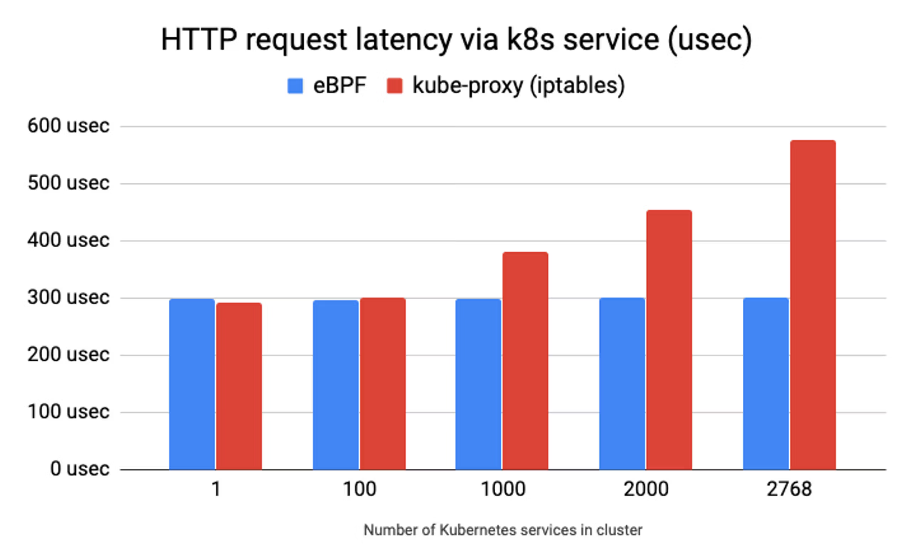
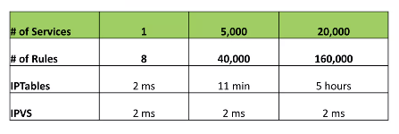
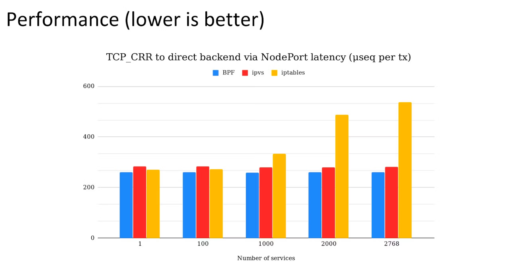
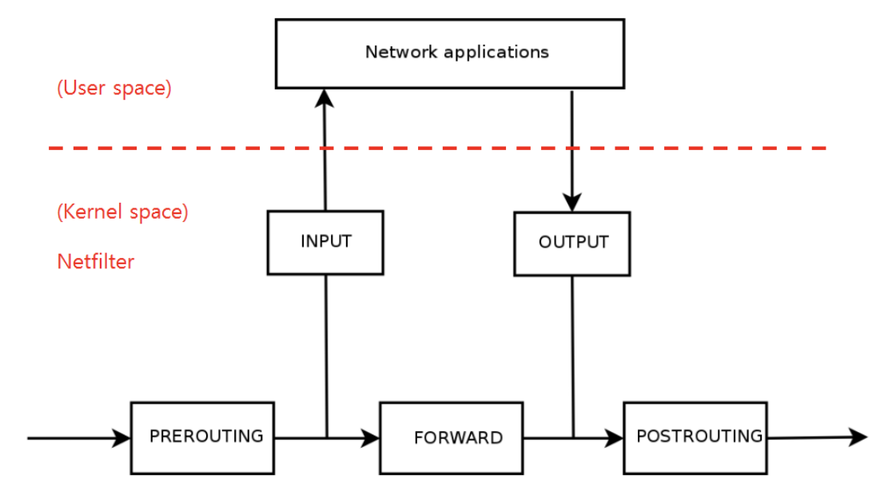
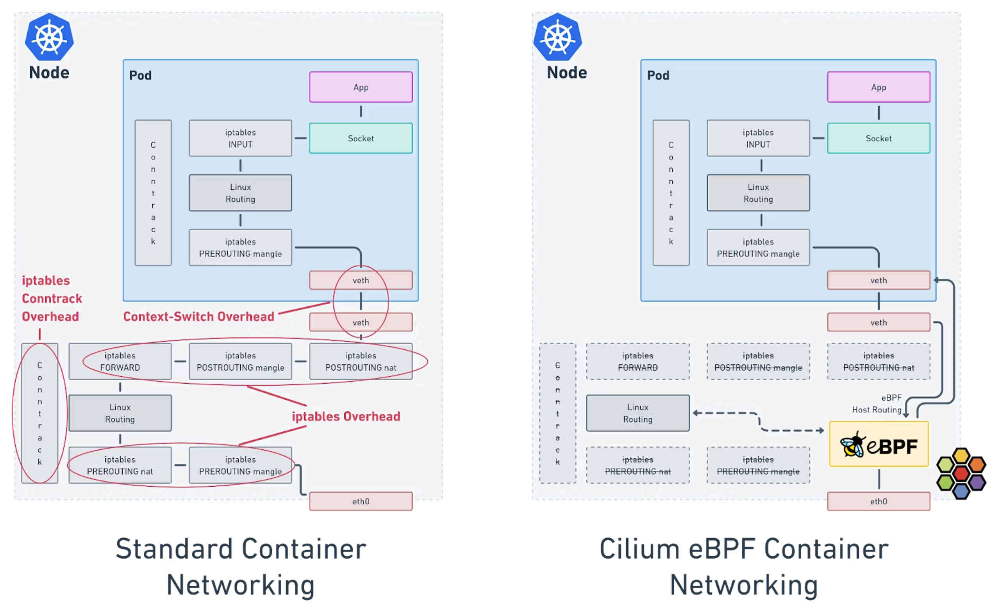

## 1. eBPF가 iptables 보다 더 성능이 좋은 이유

### 1.1 iptables의 특징

- iptables는 새 규칙 업데이트 진행 시 전체 규칙 목록을 교체한다.
- 패킷이 들어왔을 때 Linked list 로 구성된 iptables chain의 모든 규칙을 스캔한다. ※ 시간복잡도: O(n)
- L7 프로토콜에 대한 인식이 불가능하고, IP/PORT 기반으로 라우팅하는 매커니즘으로 동작한다.

### 1.2 iptables 특징으로 인해 발생하는 주요 이슈

- iptables는 새 규칙 업데이트 진행 시 전체 규칙 목록을 교체한다.
- 패킷이 들어왔을 때 Linked list 로 구성된 iptables chain의 모든 규칙을 스캔한다. ※ 시간복잡도: O(n)
- L7 프로토콜에 대한 인식이 불가능하고, IP/PORT 기반으로 라우팅하는 매커니즘으로 동작한다.

### 1.3 eBPF 성능 분석 관련 자료

#### 1.3.1 HTTP Request latency 성능



- HTTP GET request에 대한 지연 시간 측정을 위해 원격 호스트에서 10만개의 순차 request를 ab로 측정한 값이다.
- eBPF는 서비스 수 증가에 영향 없이 안정적으로 유지되지만 iptables는 서비스 수가 증가함에 따라 지연 시간이 증가 한다.

#### 1.3.2 iptables latency to add rules



- 5천 개의 서비스가 구성되어 있을 때 iptables rule 이 추가되는데 11분이 지연이 발생한다.
- iptables의 문제점을 해소하기 위해 도입된 ipvs의 경우 많은 부분의 성능 이슈를 해소하는 것으로 보인다.

#### 1.3.3 TCP CRR 성능 테스트



- TCP의 연결/요청/응답(CRR) 테스트에서도 eBPF가 가장 우수한 성능을 보여준다.
- IPVS mode kube-proxy와 비교해서도 더 나은 성능을 보여준다.


### 1.4 참고 자료

- [Scale Kubernetes to support 50000 services](https://www.slideshare.net/slideshow/scale-kubernetes-to-support-50000-services/77112281#3)
- [What is Kube-Proxy and why move from iptables to eBPF?](https://isovalent.com/blog/post/why-replace-iptables-with-ebpf/#like-a-glove-why-is-ebpf-the-standard-for-kubernetes-networking)
- [CNI Benchmark: Understanding Cilium Network Performance](https://cilium.io/blog/2021/05/11/cni-benchmark/#env)
- [Liberating Kubernetes From Kube-proxy and Iptables - Martynas Pumputis, Cilium](https://www.youtube.com/watch?v=bIRwSIwNHC0)
- [Kubecon China 2025 with bytedance - PDF](https://static.sched.com/hosted_files/kccncchn2025/64/Kubecon%20China%202025%20with%20bytedance.pdf)


## 2. iptables/netfilter 동작 원리

### 2.1 iptables와 netfiler

- iptables는 User Space에서 동작하고, netfilter는 Kernel Space에서 동작한다.
- netfilter는 커널에 통합되어 있는 프레임워크 인데, 네트워크 패킷이 시스템에 들어오고 나가는 과정에 특정 지점을 Hook Point로 지정해 패킷을 가로채고 처리할 수 있다.
- iptables는 netfilter에 규칙을 밀어 넣고, 설정되어 있는 규칙 목록을 조회하는 용도로 사용한다.

### 2.2 netfilter 구성요소

- Hooks : 패킷이 커널 특정 지점에 도달했을 때 동작하는 실행 지점이다. INPUT, OUTPUT, FORWARD, PREROUTING, POSTROUTING 5개가 존재한다.
- Tables : 규칙들을 그룹화해서 관리하기 위한 공간이다. filter, nat, mangle, raw, security 테이블이 있다. 
- Chains : 테이블 내 순서대로 처리되는 규칙의 집합이다. 테이블 마다 고유한 체인 집합을 가진다. filter에는 INPUT, OUTPUT, FORWARD 체인을 가질 수 있다.
- Rules : 패킷을 어떻게 처리할지 정의한 규칙이다.

### 2.3 netfilter Traffic Flow



| netfilter hook | iptables chain | description |
|---|---|---|
| NF_IP_PRE_ROUTING | PREROUTING | 인터페이스를 통해 들어온 패킷 처리 (ex: 목적지(DNAT) 주소 변경) |
| NF_IP_LOCAL_IN | INPUT | 인터페이스를 통해 호스트 PC의 프로세스로 패킷이 전달되기 전에 처리(차단/허용) |
|  |  | 패킷을 받아 처리할 프로세스가 내부 시스템에서 동작하는 경우 INPUT Hook을 지나 User Space의 프로세스로 전달 |
| NF_IP_LOCAL_OUT | OUTPUT | 해당 프로세스에서 처리한 패킷을 밖으로 나가는 패킷 처리(차단/허용) |
| NF_IP_FORWARD | FORWARD | 다른 호스트로 통과시켜 보낼 패킷에 대한 처리(차단/허용). 방화벽이나 IPS 등과 같이 내가 수신하는 패킷이 아니고 라우팅 해야 하는 패킷 처리 |
| NF_IP_POST_ROUTING | POSTROUTING | 인터페이스를 통해 나갈 패킷에 대한 처리 (SNAT: 출발지 주소 변경) |

## 3. eBPF vs iptables traffic flow 비교



- Cilium은 eBPF를 이용해 iptables의 오버헤드를 우회한다.
- 효율적인 패킷 처리를 통해 지연 시간과 CPU 오버헤드 감소

### 3.1 iptables conntrack overhead

- 네트워크 연결 상태를 추적해 보안과 세션 관리를 용이하게 해준다.
- 연결이 많아지면 자원 소모량이 늘어나면서 CPU, Memory 사용 증가와 함께 지연시간이 증가하게 된다.

### 3.2 iptables overhead

- 패킷을 규칙과 일치시키는 과정에서 발생하는 CPU와 메모리 사용의 추가적인 부담
- 규칙이 많거나 연결 추적을 사용하면 오버헤드가 증가

### 3.3 Context-switch overhead

- 여러 프로세스 간에 작업을 전환할 때 발생하는 성능 손실
- 작업 전환이 많아질수록 실제 연산 시간보다 전환에 소요되는 시간이 늘어나 시스템 성능 저하

## 4. Cilium과 Flannel CNI의 iptables 비교

### 4.1 Flannel 

- flannel 설치 후 통신 테스트용 pod와 service type 리소스 배포 결과
- 리소스 조회

```bash
$ kubectl get po,svc -owide
NAME                          READY   STATUS    RESTARTS   AGE     IP           NODE          NOMINATED NODE   READINESS GATES
pod/curl-pod-01               1/1     Running   0          2m37s   10.244.0.6   flannel-ctr   <none>           <none>
pod/curl-pod-02               1/1     Running   0          2m37s   10.244.0.7   flannel-ctr   <none>           <none>
pod/webpod-697b545f57-8mvvn   1/1     Running   0          111s    10.244.2.2   flannel-w2    <none>           <none>
pod/webpod-697b545f57-nvbq6   1/1     Running   0          111s    10.244.1.2   flannel-w1    <none>           <none>

NAME                 TYPE        CLUSTER-IP    EXTERNAL-IP   PORT(S)   AGE    SELECTOR
service/kubernetes   ClusterIP   10.96.0.1     <none>        443/TCP   14h    <none>
service/webpod       ClusterIP   10.96.15.30   <none>        80/TCP    111s   app=webpod
```

- iptables 정보 조회 (webpod 서비스 관련 규칙만 발췌, 전체 규칙 수: 78개)

```bash
$ iptables -t nat -S
# 기본 정책
-P PREROUTING ACCEPT
-P INPUT ACCEPT
-P OUTPUT ACCEPT
-P POSTROUTING ACCEPT

# 체인 정의 (총 20개: flannel 1개, kube-proxy 19개)
-N FLANNEL-POSTRTG
-N KUBE-SEP-PQBQBGZJJ5FKN3TB
-N KUBE-SEP-WEW7NHLZ4Y5A5ZKF
-N KUBE-SVC-CNZCPOCNCNOROALA
... (kube-dns, kubernetes API 등 기본 서비스 체인 생략)

# PREROUTING/POSTROUTING 진입점
-A PREROUTING -m comment --comment "kubernetes service portals" -j KUBE-SERVICES
-A OUTPUT -m comment --comment "kubernetes service portals" -j KUBE-SERVICES
-A POSTROUTING -m comment --comment "kubernetes postrouting rules" -j KUBE-POSTROUTING
-A POSTROUTING -m comment --comment "flanneld masq" -j FLANNEL-POSTRTG

# Flannel SNAT 규칙
-A FLANNEL-POSTRTG -m mark --mark 0x4000/0x4000 -m comment --comment "flanneld masq" -j RETURN
-A FLANNEL-POSTRTG -s 10.244.0.0/24 -d 10.244.0.0/16 -m comment --comment "flanneld masq" -j RETURN
-A FLANNEL-POSTRTG -s 10.244.0.0/16 -d 10.244.0.0/24 -m comment --comment "flanneld masq" -j RETURN
-A FLANNEL-POSTRTG ! -s 10.244.0.0/16 -d 10.244.0.0/24 -m comment --comment "flanneld masq" -j RETURN
-A FLANNEL-POSTRTG -s 10.244.0.0/16 ! -d 224.0.0.0/4 -m comment --comment "flanneld masq" -j MASQUERADE --random-fully
-A FLANNEL-POSTRTG ! -s 10.244.0.0/16 -d 10.244.0.0/16 -m comment --comment "flanneld masq" -j MASQUERADE --random-fully

# KUBE-SERVICES에서 webpod ClusterIP(10.96.15.30:80)로 매칭
-A KUBE-SERVICES -d 10.96.15.30/32 -p tcp -m comment --comment "default/webpod cluster IP" -m tcp --dport 80 -j KUBE-SVC-CNZCPOCNCNOROALA

# webpod 서비스 로드밸런싱 (50% 확률로 2개 endpoint 분배)
-A KUBE-SVC-CNZCPOCNCNOROALA ! -s 10.244.0.0/16 -d 10.96.15.30/32 -p tcp -m comment --comment "default/webpod cluster IP" -m tcp --dport 80 -j KUBE-MARK-MASQ
-A KUBE-SVC-CNZCPOCNCNOROALA -m comment --comment "default/webpod -> 10.244.1.2:80" -m statistic --mode random --probability 0.50000000000 -j KUBE-SEP-PQBQBGZJJ5FKN3TB
-A KUBE-SVC-CNZCPOCNCNOROALA -m comment --comment "default/webpod -> 10.244.2.2:80" -j KUBE-SEP-WEW7NHLZ4Y5A5ZKF

# webpod endpoint DNAT (ClusterIP -> Pod IP 변환)
-A KUBE-SEP-PQBQBGZJJ5FKN3TB -s 10.244.1.2/32 -m comment --comment "default/webpod" -j KUBE-MARK-MASQ
-A KUBE-SEP-PQBQBGZJJ5FKN3TB -p tcp -m comment --comment "default/webpod" -m tcp -j DNAT --to-destination 10.244.1.2:80
-A KUBE-SEP-WEW7NHLZ4Y5A5ZKF -s 10.244.2.2/32 -m comment --comment "default/webpod" -j KUBE-MARK-MASQ
-A KUBE-SEP-WEW7NHLZ4Y5A5ZKF -p tcp -m comment --comment "default/webpod" -m tcp -j DNAT --to-destination 10.244.2.2:80
```

### 4.2 Cilium 

- cilium 설치 후 통신 테스트용 pod와 service type 리소스 배포 결과
- 리소스 조회

```bash
$ kubectl get po,svc -owide
NAME                          READY   STATUS    RESTARTS      AGE     IP             NODE         NOMINATED NODE   READINESS GATES
pod/curl-pod                  1/1     Running   3 (10h ago)   5d23h   172.20.2.97    cilium-ctr   <none>           <none>
pod/webpod-697b545f57-ggx49   1/1     Running   5 (14h ago)   46h     172.20.0.113   cilium-w1    <none>           <none>
pod/webpod-697b545f57-qgl6m   1/1     Running   1 (27h ago)   6d2h    172.20.1.222   cilium-w2    <none>           <none>

NAME                 TYPE        CLUSTER-IP     EXTERNAL-IP   PORT(S)   AGE     SELECTOR
service/kubernetes   ClusterIP   10.96.0.1      <none>        443/TCP   7d1h    <none>
service/webpod       ClusterIP   10.96.88.175   <none>        80/TCP    6d17h   app=webpod
```

- iptables 정보 조회

```bash
$ iptables -t nat -S
-P PREROUTING ACCEPT
-P INPUT ACCEPT
-P OUTPUT ACCEPT
-P POSTROUTING ACCEPT
-N CILIUM_OUTPUT_nat
-N CILIUM_POST_nat
-N CILIUM_PRE_nat
-N KUBE-KUBELET-CANARY
-A PREROUTING -m comment --comment "cilium-feeder: CILIUM_PRE_nat" -j CILIUM_PRE_nat
-A OUTPUT -m comment --comment "cilium-feeder: CILIUM_OUTPUT_nat" -j CILIUM_OUTPUT_nat
-A POSTROUTING -m comment --comment "cilium-feeder: CILIUM_POST_nat" -j CILIUM_POST_nat
```