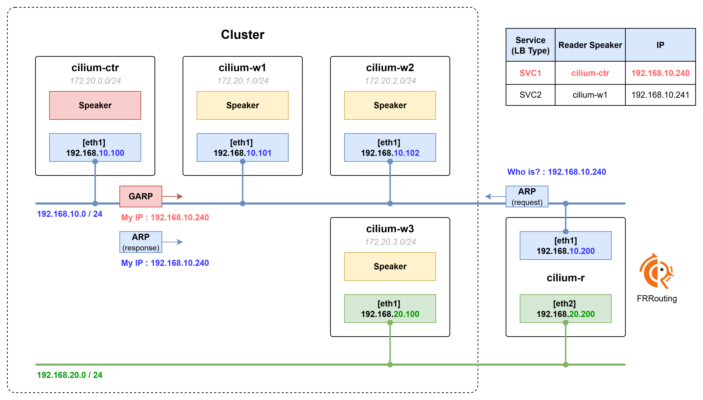
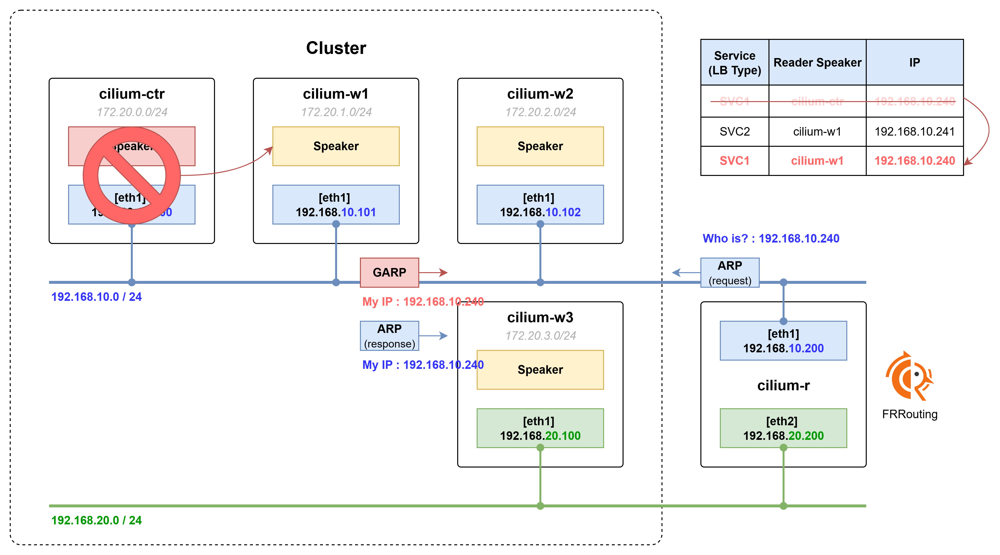

# 기본동작

- Cilium의 L2 Announcemenst MetalLB의 L2 Advertisement 동작과 유사하다.
- 각 노드에는 호스트 네임스페이스에 Speaker Pod가 배치된다. 그리고 생성되는 LoadBalancer Type 서비스의 IP마다 Reader Speaker가 선정된다.
- Reader Speaker는 GARP 또는 ARP를 이용해서 자신이 광고하는 IP 주소에 대한 MAC 주소 정보를 응답한다.

# 장애 발생 시

- 장애가 발생하면 다른 노드가 해당 Reader Speaker 역할을 위임 받아 대신 처리한다.

# 제약사항